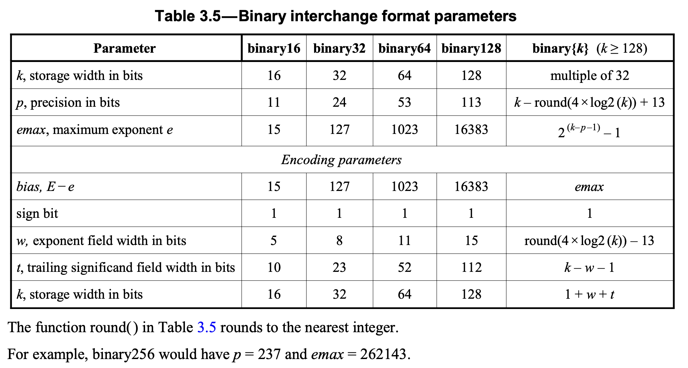
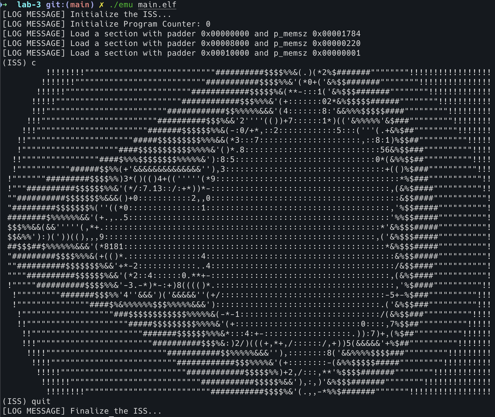

## Chapter 1. Application Binary Interface (ABI)

!!! info "參考"
	RISC-V ABI Specification: [A RISC-V ELF psABI Document](https://github.com/riscv-non-isa/riscv-elf-psabi-doc)

### 1.1 What is ABI?

ABI 全稱 Application Binary Interface，常常被拿來和 ABI 對比的是 API (Application Programming Interface)。
就定義上來說，ABI 基本上最重要的部分就是規範了 Calling Convention，也就是函數呼叫的過程中，一系列需要遵守的規定，包含暫存器的使用、參數如何傳遞，還有 Caller-Callee Save 等等的議題。
不過，確實你看完這些之後可以知道 ABI 是什麼東西還有 ABI 規範了哪些東西，但是**你知道為什麼需要 ABI 的存在嗎？**

通常會關心 ABI 的人是開發編譯工具鏈（如 GCC、LLVM）、開發作業系統還有系統函式庫的開發者，但如果你會在 Assembly-Level 進行開發或者是想要實現跨語言間的函式調用的話，也會需要理解 ABI。

讓我們以參數傳遞為例來解釋 ABI 的重要性。從 CPU 的角度來看，函式的參數可以透過暫存器或堆疊來傳遞。假設我們手寫了一個組合語言程式，並希望在其中呼叫 C 標準函式庫中的 `printf` 函數，我們該如何正確地傳遞參數呢？
如果沒有 ABI 規範 **函式呼叫約定**（Procedure Calling Convention），你是否能確定該使用哪些暫存器，或是該如何利用堆疊來傳遞參數？

若我們自己假設的參數傳遞方式與編譯器實際遵循的 Calling Convention 不一致，那麼當組合語言程式呼叫 `printf` 時，參數就無法正確傳遞，導致執行錯誤。
因此，ABI 的存在就是為了提供一套標準，使得不同語言或編譯器之間可以正確地進行互動與協作，確保程式能夠正常運作。

另外一個例子就是我們剛剛提到，當你需要在不同的程式語言之間互相調用函式時，ABI 扮演了至關重要的角色。
例如，你可能需要在 C++ 程式中調用用 Fortran 或 Rust 寫的函式。如果沒有 ABI 的規範，不同語言之間就無法正確地傳遞資料或執行函式。
ABI 確保了每個語言的編譯器**在生成機器碼時**，能夠以相同的方式處理函式調用、參數傳遞和返回值，從而實現跨語言的互操作性。
所以，ABI 的規範主要作用在 Machine-Code-Level，或者說是在程式已經被編譯為 binary 後的層級。它定義了應用程式與作業系統或其他程式之間的互動方式，包括如何傳遞參數、使用暫存器、堆疊管理，以及函式返回值的處理等。因此，ABI 不僅規範了組合語言程式的運作，也同樣影響到編譯後的機器碼，使不同來源的程式碼能夠在執行時正確地協作。

### 1.2 RISC-V Calling Convention

作為指令集架構，RISC-V 也有規範自己的 ABI，我們在接下來介紹其中最重要的兩個部分，分別是 **Register Convention** 和 **Procedure Calling Convention**。
不過，RISC-V ABI 並**不限於**我們提到的這兩個部分，大家如果對於完整的 RISC-V ABI 規範有興趣的話，歡迎閱讀官方文件。

#### 1.2.1 Integer Register Convention


基本上這個部分有兩大重點，第一個是 **ABI Mnemonic**，再來就是大家上課會學到的 **Caller/Callee-Saved** 的概念。
ABI Mnemonic 的命名規定其實也是為了配合 Calling Convention，並且讓 Programmer 在使用 RISC-V 組合語言撰寫程式的時候更加方便
。如果單純看這些暫存器的別名，其實意義並不大。

要特別注意的是，上面的圖片當中有一欄是 *Preserved across calls*，這對應到 Callee-saved，以 `$ra` 為例，它的 Preserved across calls 屬性被標記為 No，表示 Caller 不可以預設 `$ra` 在進行 Procedure Calling 之後，其值會保持不變。
也因此當 `$ra` 的值對 Caller 來說是重要的話（也就表示會被用到），那麼 Caller 有自己保存 `$ra` 的**責任**。換句話說，`$ra` 這個暫存器是 Caller-saved。

#### 1.2.2 Procedure Calling Convention

!!! note "Caller/Callee-saved 的概念到底是什麼？"
	Caller-saved 表示 Caller 本身必須負起保留特定暫存器的責任。
	以 t0 暫存器為例，如果今天 caller 自己有使用到 t0，那麼他在進行 procedure calling 之前，
	因為 t0 是 caller-saved，也就表示 callee 是可以隨意使用 t0 並且不用負起任何**責任**（也就表示即使改變 t0 也不用復原它），
	但是對於 caller 來說 t0 如果在進行 procedure calling 然後 return 之後值就被改變了的話，可能會造成運算錯誤，
	所以 caller 就必須在 procedure calling 之前先利用 stack 的空間保存 t0 的值，這樣即使經過 procedure calling 之後 t0 被改變了，
	caller 依然可以利用 stack 中所保存的資訊來恢復 t0 並繼續進行運算。

	而 callee-saved 的概念就類比於 caller-saved，對於 callee-saved 的暫存器來說，我們以 s0 為例，s 是 saved 的簡寫，這裡所說的 saved register 是以 caller 的角度出發。
	也就是對於 caller 來說，它可以認定 s0 ~ s11 這十二個暫存器是為了 caller 而保留的，因此 caller 可以假設即使經過 procedure calling，在 procedure return 之後 s0 ~ s11 的值是不會改變的。
	但是，如果為了達到這樣子的需求我們直接限制 callee 不可以使用 s0 ~ s11 的話，相當於有一大部分的暫存器都不能使用了，這樣對效能一定會有相當大的衝擊。
	因此，實際上 callee 依然可以使用 saved register，但是這時候 callee 就有了**使用後必須還原的責任**，這樣就可以營造一個對於 caller 來說看起來 saved register 不會被改變的錯覺（illusion）。
	對於 callee 來說，一樣是利用 stack 來保存 callee-saved register，在進入 procedure 的最一開始先保存這些暫存器之後再開始進行運算，結束運算之後將這些暫存器復原並且恢復 stack 之後，才 return 回到 caller。
	這樣對於 caller 來說**看起來** saved register 似乎沒有被動過，但實際上是可能被使用過，但是又被還原了。

總結來說，RISC-V ABI 當中對於 Function Call 有著下面這些規範（只講述最為重要的部分）

1. the contents of any register without specifying it as an argument register in the calling convention are unspecified upon entry
2. the content of any register without specifying it as a return value register or callee-saved in the calling convention are unspecified upon exit
3. the contents of all callee-saved registers must be restored to what was set on entry
4. the contents of any fixed registers like gp and tp never change
5. The base integer calling convention provides eight argument registers, a0-a7, the first two of which are also used to return values
6. Scalars that are at most XLEN bits wide are passed in a single argument register, or on the stack by value if none is available.
7. **About the stack itself**
    - The stack grows downwards (towards lower addresses)
    - the stack pointer shall be aligned to a 128-bit boundary upon procedure entry
    - The first argument passed on the stack is located at offset zero of the stack pointer on function entry; following arguments are stored at correspondingly higher addresses

    	> 這條規範**針對**的是多出來必須用 Stack 傳遞的 Function Argument，要從 offset 等於 0 開始，但是如果是在 Function Prologue & Epilogue 保存暫存器（e.g., Callee-Saved）的話，並不用遵守這個限制

    - In the standard ABI, the stack pointer must remain aligned throughout procedure execution

在 Assembly Programming 中，Procedure（或稱 Function）通常（但不一定）會包含三個部分，分別是 **Prologue**、**Procedure Body** 還有 **Epilogue**。如果直接撰寫 C 語言中的 Function，通常不會注意到 Prologue 還有 Epilogue，因為在編譯階段，編譯器就會自動替我們的 C Function 加上 Prologue 和 Epilogue 來進行 Stack 和 Register 的管理，讓我們可以專注在 Procedure Body 的實作即可。但是當我們使用組合語言撰寫程式的時候，我們就必須自己實作出 Prologue 和 Epilogue，這樣才得以遵守 Procedure Calling Convention，把該存的資料存進 Stack 當中，並且在必要的時候將資料還原。

!!! info "參考"
	在程式設計中，function prologue 和 epilogue 是函數進入與退出的過程。這些步驟主要與堆疊的使用和寄存器的保存有關，是編譯器在生成組合語言或機器碼時自動添加的，以便確保函數能正確地呼叫與返回，且不影響主程式的其他部分。

	參考：[Wikipedia - Function prologue and epilogue](https://en.wikipedia.org/wiki/Function_prologue_and_epilogue)

#### 1.2.3 Case Study - Calculation of Fibonacci Number

!!! note "參考編譯指令"
	- `riscv64-unknown-elf-gcc -march=rv64i -mabi=lp64 -S -O0 -fomit-fram-pointer <file-name>`
		- 你可以試試看把 `-fomit-frame-pointer` 從指令中移除並且再次編譯，觀察產生出的 assembly code 發生了什麼變化？（關鍵字：RISC-V Frame-Pointer）
		- **Frame-Pointer is not necessary but useful for debugging**

```cpp linenums="1"
unsigned long fib(unsigned long n) {
    if (n < 2) {
        return n;
    }
    return fib(n - 1) + fib(n - 2);
}
```

費波那契數列常常被作為 Assembly Programing 的經典題目，甚至考研究所的題目也曾經出現過。
但是，這個程式卻也常常讓人看不出來關於 Caller-saved 和 Callee-saved 的界線，也就是說看不出來到底誰是 Caller 而誰是 Callee。

```asm linenums="1"
	.file	"fib.c"
	.text
	.align	2
	.globl	fib
	.type	fib, @function
fib:
	# prologue
	addi	sp,sp,-32
	sd	ra,24(sp)
	sd	s0,16(sp)
	sd	a0,8(sp)
	# function body
	ld	a4,8(sp)
	li	a5,1
	bgtu	a4,a5,.L2
	ld	a5,8(sp)
	j	.L3
.L2:
	ld	a5,8(sp)
	addi	a5,a5,-1
	mv	a0,a5
	call	fib
	mv	s0,a0
	ld	a5,8(sp)
	addi	a5,a5,-2
	mv	a0,a5
	call	fib
	mv	a5,a0
	add	a5,s0,a5
.L3:
	# epilogue
	mv	a0,a5
	ld	ra,24(sp)
	ld	s0,16(sp)
	addi	sp,sp,32
	jr	ra
```

會造成混淆最根本的原因是因為 `fib` 這個 function 本身是一個 Recursive Function，換句話說 fib 同時是 Caller 也是 Callee，因為他會呼叫自身（call itself），所以也會造成 Caller-saved 和 Callee-saved 這兩個部分可以被放在一起。
我們觀察上面的組合語言可以看到在 Function Prologue 的部分，保存了暫存器 ra、s0 和 a0，我們查閱前面提到的 Integer Register Convention 可以發現只有 s0 是 Callee-saved，但是 ra 和 a0 其實都是 Caller-saved。
不過在 GCC 所產生的組合語言當中，我們可以看到這兩個部分都被放到了 Prologue 當中。

#### Case Study - C-Assembly Hybrid Programming

在系統軟體的開發中，尤其像是作業系統或是驅動程式（Driver），常常需要直接使用組合語言實作部分的 Function，並且在 C 語言中呼叫這些用組合語言實作的 Function。
我們稱這種開發情境叫做 ***C-Assembly Hybrid Programming***，在這種情境底下遵守 ABI 就顯得特別重要，尤其是對於撰寫組合語言的開發者來說。

```cpp linenums="1"
extern int sum(int a, int b, int c);

int foo(void) {
    return sum(1, 2, 3);
}
```

假設我們使用 RISC-V Assembly 來完成 `int sum(int, int, int)` 的實作，並且在 C Source Code 中呼叫 `sum()`，我們先把 `foo()` 這個函式編譯成只使用 RV64I 指令的組合語言

```asm linenums="1"
    .file	"foo.c"
    .text
    .align	2
    .globl	foo
    .type	foo, @function
foo:
    # function prologue
    addi sp,sp,-16
    sd ra,8(sp)
    # function body
    li a2,3
    li a1,2
    li a0,1
    call sum
    mv a5,a0
    mv a0,a5
    # function epilogue
    ld ra,8(sp)
    addi sp,sp,16
    jr ra # alias for: jalr x0, ra, 0
```

我們可以看到 GCC C Compiler 將這段 C 語言程式碼轉換成 RV64I 組合語言的時候，使用了 a0、a1 和 a2 來傳遞參數給 sum 函式。
進入 sum 函式之後，先在 stack 上分配了 16-bytes 的空間，並且使用其中一個 double-word 大小的空間來保存 ra，並且將參數利用 load-immediate (`li`) 指令載入暫存器之後，利用 `call` 這個 pseudo-instruction 來呼叫函式 `sum`，
之後再將 a0 的值複製到 a5，並且再將 a5 的值複製回 a0，之後便恢復原本 ra 的值，然後就 return（對應到 `jr ra`），由此也可以看出這裡一樣遵守 RISC-V ABI 的規範，將 return value 存放在 a0 當中。

如果今天沒有一套明確的規範，尤其是針對 Calling Convention，那麼對於使用 assembly code 實作 sum 函式的這個人來說就會非常苦惱，因為他會不知道到底參數透過哪些暫存器傳遞、不知道他該負起哪些責任保證哪些暫存器的值會在函式調用的前後保持一致，還有傳回 return value 的時候又該放在哪個暫存器。
以下我們遵守 ABI 的規範，示範一個 sum 函式的組合語言實作。

```asm linenums="1"
    .file    sum.s
    .text
    .align   2
    .global  sum
    .type    sum, @function
sum:
    # function prologue
    addi sp, sp, -16
    sd s0, 0(sp)
    # function body
    mv s0, a0
    add s0, s0, a1
    add s0, s0, a2
    mv a0, s0
    # function epilogue
    ld s0, 0(sp)
    addi sp, sp, 16
    ret
```

如此一來，即使我們是使用 assembly 實作 sum 函式，但是因為我們嚴格依照 RISC-V ABI 規範去實作，就可以和以 C 語言撰寫的 foo 函式互相配合，而不會出現錯誤。

再讓我們看一個更極端的例子，假設我們有八個以上的參數要進行傳遞的話，依照前面的論述，如果 a0 ~ a7 這八個暫存器不敷使用的話，會使用 Stack 來傳遞剩餘參數。考慮以下 C Code：

```cpp linenums="1"
extern int sum(int a, int b, int c, int d, int e, int f, int g, int h, int i, int j, int k);

int foo(void){
    return sum(1, 2, 3, 4, 5, 6, 7, 8, 9, 10);
}
```

使用 `riscv64-unknown-elf-gcc -march=rv64i -mabi=lp64 -O0 -fomit-frame-pointer -S foo.c`，我們可以得到以下的結果

```asm linenums="1"
	.option nopic
	.text
	.align	2
	.globl	foo
	.type	foo, @function
foo:
  	# allocate 32-bytes in the stack to pass last two arguments
	addi	sp,sp,-32
	sd	ra,24(sp)
	li	a5,10
	sd	a5,8(sp)
	li	a5,9
	sd	a5,0(sp)
  	# pass the first 8 arguments by using a0 ~ a7
	li	a7,8
	li	a6,7
	li	a5,6
	li	a4,5
	li	a3,4
	li	a2,3
	li	a1,2
	li	a0,1
	call	sum
	mv	a5,a0
	mv	a0,a5
	ld	ra,24(sp)
	addi	sp,sp,32
	jr	ra
```

根據前面我們提到 RISC-V ABI 的規則，在當使用 Stack 進行參數傳遞的時候，第一個要放進 Stack 中的參數應該放在 offset 等於 0 的位置，而根據上面的 Assembly Code，它確實把第九個參數，常數 9 放在 stack 中 offset 為 0 的位置，對應到 `li a5, 9` 和 `sd a5, 0(sp)`，符合 RISC-V ABI 的規範。

!!! note "More about ABI - Named ABI and C/C++ Type Details"
	**編譯的時候，傳入的 options 中的其中一個 `-mabi=lp64` 功能到底是什麼？**

	ABI 除了規範我們前面提到的 Register Convention 和 Procedure Calling Convention 以外，也規範了 C/C++ Type Details。
	在 Type Details 當中，規範了 C/C++ 中各種不同 Data Types 的 **size** 和 **alignment**。

	LP64, LP64F, LP64D, and LP64Q: Use the following type sizes and alignments (based on the LP64 convention):

	| Type                 | Size (Bytes)  | Alignment (Bytes) | Note |
	|:---------------------|:-------------:|:-----------------:|:-----|
	| bool/_Bool           |  1            |  1                ||
	| char                 |  1            |  1                ||
	| short                |  2            |  2                ||
	| int                  |  4            |  4                ||
	| long                 |  8            |  8                ||
	| long long            |  8            |  8                ||
	| __int128             | 16            | 16                ||
	| void *               |  8            |  8                ||
	| __bf16               |  2            |  2                | Half precision floating point (bfloat16)|
	| _Float16             |  2            |  2                | Half precision floating point (binary16 in IEEE 754-2008)|
	| float                |  4            |  4                | Single precision floating point (binary32 in IEEE 754-2008)|
	| double               |  8            |  8                | Double precision floating point (binary64 in IEEE 754-2008)|
	| long double          | 16            | 16                | Quadruple precision floating point (binary128 in IEEE 754-2008)|
	| float _Complex       |  8            |  4                ||
	| double _Complex      | 16            |  8                ||
	| long double _Complex | 32            | 16                ||

	以 RV64 來說，總共定義了 LP64、LD64F、LP64D 和 LP64Q 這四種 Named ABI，他們的 Type Details 都基於上面的表格，唯一不同的是 F、D 和 Q 代表是否使用 RISC-V 的浮點數擴展（Extension）。
	以 LP64 為例，L 代表 Long 且 P 代表 Pointer，所以 LP64 代表 Long 和 Pointer 的長度都是 64-bit。
	我們以 `unsigned int` 和 `unsigned long` 為例，在 LP64 的規範中，前者的長度是 32-bit 而後者是 64-bit，這樣的差異會直接影響到兩者可以表示的值域範圍。
	只不過就算我們在寫程式的時候使用的是 32-bit 長度甚至是更小的 data type，還是依然會被載入到 64-bit 的暫存器中再進行運算。 

## Chapter 2. Bare-metal Runtime Environment

以目前我們實作的 Simple RISC-V ISA Simulator 來說，已經具備最基本的整數運算功能，還有輸出輸入的功能，那是否代表我們已經可以用這個 Simulator 來執行各種程式了？
這個問題攸關於**圖靈完備性**（Turing Complete）。簡單來說，目前我們所實作的 ISS 已經具備基本的算術指令、分支指令（Branch & Dump）還有 Load/Store 指令，
所以已經可以模擬一個圖靈機（Turing Machine）的運作，可以解決通用計算問題。
再加上我們利用 ECALL 指令的實作賦予我們的系統 I/O 的功能，讓我們可以更輕易地觀察系統的運作並且和系統進行互動。

但是，即使我們的 ISS 已經具備計算任何可計算問題的能力了，但有一個令人頭疼的問題是，==在這樣的系統上面進行開發容易嗎？==
不論是開發 CPU，或是開發各式各樣不同形式的計算機系統，我們終究需要在其上開發軟體，使其可以依照我們想要的方式進行運作，因此關注開發容易程度是一件重要的事情。

!!! success
	這個問題可以進一部探討到作業系統的誕生，還有各式各樣系統軟體的發展。

回憶一下助教在 Lab 2 提供的範例程式 `hello.c`，它可以使 ISS 輸出 `Hello, World!` 並結束，這個程式的原始碼如下：

```cpp linenums="1"
int main(void) {
    /* print the string "Hello, World!\n" and ends the program */
    asm volatile("li a0, 1\n"
                 "li a1, 'H'\n" // 'H'
                 "ecall\n"
                 "li a0, 1\n"
                 "li a1, 'e'\n" // 'e'
                 "ecall\n"
                 "li a0, 1\n"
                 "li a1, 'l'\n" // 'l'
                 "ecall\n"
                 "li a0, 1\n"
                 "li a1, 'l'\n" // 'l'
                 "ecall\n"
                 "li a0, 1\n"
                 "li a1, 'o'\n" // 'o'
                 "ecall\n"
                 "li a0, 1\n"
                 "li a1, ','\n" // ','
                 "ecall\n"
                 "li a0, 1\n"
                 "li a1, ' '\n" // ' '
                 "ecall\n"
                 "li a0, 1\n"
                 "li a1, 'W'\n" // 'W'
                 "ecall\n"
                 "li a0, 1\n"
                 "li a1, 'o'\n" // 'o'
                 "ecall\n"
                 "li a0, 1\n"
                 "li a1, 'r'\n" // 'r'
                 "ecall\n"
                 "li a0, 1\n"
                 "li a1, 'l'\n" // 'l'
                 "ecall\n"
                 "li a0, 1\n"
                 "li a1, 'd'\n" // 'd'
                 "ecall\n"
                 "li a0, 1\n"
                 "li a1, '!'\n" // '!'
                 "ecall\n"
                 "li a0, 1\n"
                 "li a1, '\n'\n" // '\n'
                 "ecall\n"
                 "li a0, 0\n"
                 "ecall\n" // end the program
    );
}
```

在大家的記憶中本應該只需要 `#include <stdio.h>` 和 `printf("Hello, World!\n")` 就好了，為什麼現在需要寫這麼多程式碼，甚至需要手寫組合語言才能達到一樣的功能？
我們換個方式思考，其實所有在 CPU 上面運作的程式都會先被 Compiler 編譯成對應特定指令集架構的組合語言，然後再經由 Assembler 轉換成機械碼之後，最後才得以運行在 CPU 之上，因為特定的指令才是 CPU 得以解讀的資訊。
所以，使用組合語言撰寫任何程式其實是一件符合直覺得事情。但是我們之所以很少這樣做的原因就是因為，這樣做效率太低了！
在你之前寫程式的記憶當中，你隨意呼叫的一個 C Standard Library 中的 Function 背後可能都對應到上萬條組合語言，你有辦法想像這幾萬條指令都靠你手動自己一個一個寫出來嗎，顯然這是不切實際的。

### 2.1 Hardware-Dependent Core Library

目前對我們的 ISA Simulator 來說，直接和硬體相關的並且我們需要的操作有兩個

1. 控制 ISS 是否停止執行指令（Halt）
    - 因為 ISS 本身會不斷地重複執行指令的這個步驟，因此必須要提供一個機制，來告訴 ISS 什麼時候應該要停下來，並且將控制權轉移回 User 手上
2. I/O 相關功能（輸出、輸入）
    - 目前僅實作輸出的功能，暫時不實作輸入功能
    - 輸出相關的函數如 `putchar`、`putint` 和 `printf`


> Use abstraction to simplify design.<br>
> ----- 8 Great Ideas in Computer Architecture, By David A. Patterson, PhD

```cpp linenums='1' title='core.h'
#ifndef __CORE_H__
#define __CORE_H__

#include <stdint.h>

/* system call enumeration list */
#define SYS_EXIT 0
#define SYS_PUTC 1

static inline void __internal_syscall(uint64_t arg0, uint64_t arg1) {
    register uint64_t a0 asm("a0") = arg0;
    register uint64_t a1 asm("a1") = arg1;
    asm volatile("ecall" ::"r"(a0), "r"(a1) :);
}

#define SYSCALL_1(A0) __internal_syscall(A0, 0)
#define SYSCALL_2(A0, A1) __internal_syscall(A0, A1)

/* function used to exit the current running program */
extern void terminate(void) __attribute__((noreturn));

/* basic output function (single character as unit) */
extern void platform_outb(char c);

#endif
```

在 `core.h` 中我們首先定義了 `__internal_syscall` 這個函式，作為硬體相關函式呼叫的基礎，然後基於參數個數的不同，我們又分別定義了 `SYSCALL_1` 和 `SYSCALL_2`。
接下來我們宣告（Declare）了最重要的兩個函式，分別是 `terminate` 用來作為 RISC-V Program 結束時應該要主動呼叫的函式，以讓 ISS 停下。
而 `platform_outb` 則可以向 ISS 發出請求，請其幫忙印出一個字元（character）。

> 因為 `char` 的大小為一個 byte，因此該函數的後綴 outb 代表的含義是 output byte。

```cpp linenums='1' title='core.c'
#include "core.h"

void terminate(void) {
    for (;;) {
        SYSCALL_1(SYS_EXIT);
    }
}

void platform_outb(char c) { SYSCALL_2(SYS_PUTC, c); }
```

在 `core.c` 中我們定義（Define）了 `terminate` 和 `platform_outb`。因為 `terminate` 只需要傳入一個參數，也就是暫存器 $a0 的值，更精確地說是將 $a0 設為 0，所以實作上我們使用 `SYSCALL_1`。
而根據 Lab 2 對 ISS 的實作規範，我們可以得知 `platform_outb` 要在呼叫 ECALL 指令之前將 $a0 設成 1，並且將欲印出的字元的數值放進 $a1 當中，因此我們使用 `SYSCALL_2`。

### 2.2 Hareware-Independent Library

當我們對硬體相關的操作進行基本的抽象化之後，我們就可以利用 Hardware-Depedent Core Library 來建構其餘和硬體無關的細節部分。
如 I/O Library 和 Floating-Point Mmulation Library。

#### 2.2.1 I/O Library

正常來說，I/O Library 如 C 語言中的 `stdio.h` 應該要同時包含輸出和輸入的功能，如 `printf` 和 `scanf` 這兩個函式。
但是，因為實作輸入功能的話，會涉及到中斷（Interrupt）這個功能的實作，已經超出這份教材的範圍。因此，在這裡我們僅實作輸出相關功能。

```cpp linenums='1' title='io.h'
#ifndef __IO_H__
#define __IO_H__

/* basic output library */
void putchar(char c);
void puts(char *s);
void putint(int integer);
void printf(char *format, ...);

#endif
```

```cpp linenums='1' title='io.c'
#include "../include/io.h"

#include "../include/core.h"

#include <stdarg.h>

#define NOT_IMPLEMENTED                                                        \
    do {                                                                       \
        puts("Please implement the function by yourself!\n");                  \
        terminate();                                                           \
    } while (0);

void putchar(char c) { platform_outb(c); }

void puts(char *s) {
    while (*s != '\0') {
        putchar(*(s++));
    }
}

void putint(int numb) {
    if (numb < 0) {
        putchar('-');
        numb = -numb; // convert to positive number
    }

    if (numb / 10) {
        putint(numb / 10);
    }
    putchar((numb % 10) + '0');
}

void printf(char *format, ...) {
    NOT_IMPLEMENTED
    // TODO
}
```

#### 2.2.2 Integer Multiplication and Division Emulation

因為在 RISC-V 的架構中，整數乘除法相關的指令是被定義在 **M-Extension** 當中，並不包含在 RV32/64I 當中，所以我們目前實作的 ISS 並不能直接執行整數乘除法相關的指令。但是，乘除法還有取模運算（Modulo Operation）在程式設計之中是相當常見的操作，如果限制我們的程式不能進行乘除法還有取模運算的話，會讓我們寫程式變得非常不方便和麻煩。但我們的 ISS 又只能執行加減法運算和常見的邏輯運算，那該怎麼辦？

本質上，乘除法還有模運算的背後也是加減法，因此利用加減法來**模擬**乘除法還有模運算是一件可以達成的事情。

!!! note "Simulation（模擬） vs. Emulation（仿真）"
	> 在計算機科學中，simulation 和 emulation 這兩個詞雖然中文都可以被翻譯為「模擬」，但它們的具體含義和應用場景是不同的。這兩者的差異主要體現在它們的目標、實作方式以及應用情境上。
	>
	> 1. Simulation（模擬）：
	Simulation 是指使用軟體或硬體來模擬系統的行為，重點是模擬系統的功能和邏輯，而不一定完全忠實於系統的實際運作方式。模擬的目的是對系統的行為進行預測、測試或分析，不要求具備實際運行該系統的能力。
	>    - ISA Simulator: 例如當提到 ISA Simulator（指令集架構模擬器），指的是模擬一個處理器的指令集架構（ISA），讓我們可以在不同的硬體上執行該 ISA 定義的指令，觀察指令執行的結果。模擬器的重點在於模擬 CPU 的行為，例如指令的執行順序、計算結果等，但模擬器不需要在真實硬體上運行，也不必考慮實際硬體的時間精度或電路細節。
	>    - 應用情境：模擬主要用於系統設計、驗證、性能分析等，例如處理器設計階段的指令集模擬、軟體開發階段的行為模擬等。這種方式可以幫助設計者在硬體還未完成之前就能進行測試。
	> 2. Emulation（仿真）：
	Emulation 則是指使用軟體或硬體來仿真另一個系統的功能與行為，並且讓它能夠忠實地執行原本應該在被仿真的系統上運行的軟體或硬體。仿真的目標是使系統「看起來」就像原系統一樣，能夠完全模擬它的功能，並且使得軟體和硬體在仿真環境中運行不會感知到差異。
	>    - Floating-Point Emulation: 當提到 Floating-Point Emulation（浮點數仿真），通常指的是使用軟體仿真來替代硬體實現浮點運算。當硬體不支持某些浮點指令時，軟體仿真器可以「模仿」硬體來執行這些浮點指令，使系統感覺不到這些運算其實是由軟體而非硬體完成的。
	>    - 應用情境：仿真主要用於替代或復現某個系統的運作方式。例如，當新的處理器不再支援舊的指令集或硬體功能時，可以使用仿真技術讓舊的軟體仍能夠運行。另一個例子是遊戲機的仿真器，它可以讓不同硬體平台執行原來只能在遊戲機上運行的遊戲。
	>
	> Simulation 是側重於模擬系統的行為或邏輯運作，不需要完全重現系統的具體運行方式，通常用於設計和驗證階段。Emulation 是側重於忠實重現另一個系統的運行方式，讓其能夠運行原本專屬於該系統的軟體或硬體功能。因此，ISA Simulator 更偏向於提供處理器行為的模擬，以便進行測試和分析，而 Floating-Point Emulation 則是指當硬體無法支持某些浮點運算時，使用軟體來仿真其功能。
	>
	> ----- ChatGPT

在這裡，因為我們使用的編譯器是 GCC（specially, RISC-V GNU Toolchain for RISC-V），而 GCC 正好提供了一個非常方便的功能，叫做 [The GCC low-level runtime library](https://gcc.gnu.org/onlinedocs/gccint/Libgcc.html)（又稱 Libgcc），
我們可以借助其中的 [Routines for integer arithmetic](https://gcc.gnu.org/onlinedocs/gccint/Integer-library-routines.html) 來完成整數乘除法和取模運算的模擬。

具體來說，Libgcc 針對硬體資源受限的硬體（e.g., 沒有內建整數乘除法器或 FPU）提供了許多方便的功能，讓硬體資源受限的硬體也可以執行更多樣的功能或運算。

> Most of the routines in libgcc handle arithmetic operations that the target processor cannot perform directly.
> This includes integer multiply and divide on some machines, and all floating-point and fixed-point operations on other machines.
> libgcc also includes routines for exception handling, and a handful of miscellaneous operations. <br>
> ----- GNU low-level runtime library

我們正好可以利用 Libgcc 當中的 **Routines for integer arithmetic** 來將乘除法運算子還有取模運算（`*`, `/` and `%`）直接轉換成對應的函式呼叫，
讓我們實作的 ISS 即使沒有 M-extension 的支援也依然可以執行對應的運算。

對於轉寫 RISC-V Program 的人來說，其實這整件事情變得很簡單！因為這些 operator 到對應 function call 的轉換是由 Compiler 自動在背後完成的，
所以我們在撰寫程式的時候只要像往常一樣，直接使用我們想要用的 operators，最後在編譯的時候，在最後面加上 `-lgcc` 的 compilation flag 即可。
`-lgcc` 這個 flag 的用途是指示 GCC 要 link 到 Libgcc，這樣我們才可以使用 Libgcc 提供的功能。

#### 2.2.3 Floating-Point Emulation Library

在 RISC-V 當中浮點數相關的運算一樣是被歸類在擴充 **F-Extension** 當中，並沒有被歸類在 RV32/64I 當中，所以我們設計的 ISS 也無法**直接以執行單一指令的方式**進行浮點數相關的運算，因為我們並沒有實作 F-Extension 中所包含的指令，還有浮點數運算所需要的暫存器。

不過，浮點數運算本質上也是二進位的邏輯運算，因此我們是有辦法利用整數指令來模擬浮點數運算的。這也和我們前面提到我們所實作的指令集已經具備 Turing Complete 的性質有關。

##### 2.2.3.1 Why Floating instead of Fixed?

<figure markdown="span">
	
</figure>

大家之前學到以 Two's Complement 表示 Binary Integer 其實就屬於定點數運算（Fixed-Point Arithmetic）的一種，只不過差別在於我們的小數點是位於最後一個 Digit 的後面，所以並沒有小數的部分。更廣義的 Fixed-Point 通常是只同時包含 Integer Part 和 Fraction Part 的格式。但浮點數則不同於定點數，浮點數使用的是所謂的 Sign-Magnitude Representation，也就是把 Sign 和數值大小（絕對值）分成兩個部分來表示，兩個部分互不相關。更精確地來說，在 Floating-Point 中，Magnitude 的部分又拆分成 Exponent 加上 Mantisa 來表示，這種表示方式造成**小數點的位置是浮動的**，這也是浮點數這個名稱的由來。浮點數表示浮動的小數點。

我們必須要有一個認知是，實數有無限多個，所以不管是以定點數還是浮點數來說，一定都會有無法精確表示的數字，譬如 $\frac{1}{3}$ 不論是以定點數還是浮點數都無法精確地表示，我們只能**近似表達**。但既然這樣為什麼我們不使用定點數來進行小數運算就好？畢竟定點數使用二補數運算，在算數單元的設計上相較 Sign-Magnitude 表示形式更為簡單，因為 Two's Complement 可以直接進行相加，不用做任何額外的操作，但是浮點數的運算通常都需要進行額外的操作，譬如 Alignment 和 Normalization。

定點數最大的一個劣勢在於沒辦法很好地表示太大或是太接近零的數字，但是浮點數受益於使用 Exponent 加上 Mantisa 來表示數值大小（Magnitude），所以藉由控制 Exponent 我們可以很輕易地得到非常大的數字或是非常接近零**但**不等於零的數字。

<figure markdown="span">
	
	<figcaption>Again, the horizontal axis is the naive interpretation of the 6 bits as an integer (though the sign is kept as a separate bit, rather than using two’s complement).
	The vertical axis is the actual floating point value represented by those bits, according the the IEEE-ish minifloat format we chose.<br>
	Source: [Fun with floating point](https://dwayneneed.github.io/.net/2010/05/06/fun-with-floating-point.html)
	</figcaption>
</figure>

不過，相較於定點數，浮點數有一個特性是數值的分布並不均勻。我們分成兩部分來討論，針對 Subnormal Floating-Point，因為 Exponent 固定為 $-126$，在不考慮正負號的情況下唯一會影響數值大小的只有 Fraction。
所以，Subnormal 的數值分布其實是均勻地，均勻地分佈在實數軸上靠近零的地方。換句話說，某種程度上我們其實可以把 Subnormal 視為是定點數。
但是，對於 Normal Floating-Point 來說，Exponent 是會變動的，這也造成了當 Exponent 越來越大的時候（也代表離實數軸上原點越來越遠），Normal 的分布會越來越不平均，分布越來越離散。

##### 2.2.3.2 IEEE 754 Single-Precision Floating-Point (Binary32) Format

!!! info "IEEE 754-2008"
	文章中關於 Single-Precision Floating-Point 的介紹基於 IEEE 754-2008 的規範，詳細內容可以參考：[754-2008 - IEEE Standard for Floating-Point Arithmetic](https://ieeexplore.ieee.org/document/4610935)


根據 IEEE 754 的規範，單精度浮點數的長度為 32-bit，其中 1-bit（MSB）作為 Sign-bit，8-bit 作為 Exponent，而最低的 23-bit 作為 Fraction。

1. 1-bit sign $S$
2. w-bit biased exponent $E = e + \text{bias}$
3. $(t = p − 1)$-bit trailing significand field digit string $T = d_1 d_2 ... d_{p-1}$; the leading bit of the significand, $d_0$, is implicitly encoded in the biased exponent E.

<figure markdown="span">
  {width=850}
</figure>

對於 binary32 來說，bias 為 127，並且 $e_{\text{max}} = 127$，而規格書也規定 $e_{\text{min}} = 1 - e_{\text{max}} = -126$。

!!! note "Significand vs. Fraction"
	當我們講 Significand 的時候，指的是浮點數表示法中的 Fraction 加上 Implicit Leading 1。如果只有說 Fraction 的話就是單純只包含小數點後的部分，不包含 Leading 1。
	在 IEEE 754 規格書中，又把 Fraction 稱為 Trailing Significand Field。

根據 IEEE 754 的規範，依照 Exponent 和 Fraction 的值的不同，可以有以下幾種情況：

<div align="center" markdown>
|     Value    |             Exponent            | Fraction (Trailing Significand) |
|:------------:|:-------------------------------:|:-------------------------------:|
|    $\pm 0$   |            All zeros            |            All zeros            |
|    Normal    | Not all zeros also not all ones |            Arbitrary            |
|   Subnormal  |            All zeros            |          Not all zeros          |
| $\pm \infty$ |             All ones            |            All zeros            |
|      NaN     |             All ones            |          Not all zeros          |
</div>

需要特別注意的是，依照 IEEE 754 的規定，Exponent 的表示方式是 $E = e + \text{bias}$，其中 $E$ 是加上 Bias 之後儲存在浮點數表示法中的 Exponent 數值，而 $e$ 是真實的 Exponent，而針對單精度浮點數來說，754 規定其 Bias 應為 127。
使用 Biased Representation (Offset Binary) 來表示 Exponent 其實是一個很巧妙的設計，我們知道單精度浮點數實際上可以表示的指數 $e$ 的範圍為 $-126 \sim 127$，加上 Bias 之後我們可以發現 $E$ 一定是一個非負整數。
先忽略 Sign-bit 並且配合 Fraction，我們其實可以將 Exponent 和 Fraction 合起來視為一個無符號數整數，然後**直接使用整數排序演算法來排序浮點數！**，針對 Sign-bit 為 1 的狀況（也就是負數）只要將排序順序顛倒即可。 
所以使用 Offset Binary 來表示 Exponent 的好處就是我們可以不用再針對浮點數實作特殊的排序演算法，而是可以直接沿用整數排序演算法。

!!! warning
    請特別注意，Subnormal Number 的指數部分是 $-126$ 而非 $-127$！

##### 2.2.3.3 Rouding and Calculation Error

!!! note "Keyword"
	- IEEE 754-2008
	- Infinite Precision
	- Guard, Round and Sticky Bit (GRS)
	- Units at the last bit (ulp)
	- Rounding Mode, Round-to-the-Nearest

!!! info "參考"
	[稽核分析中數字四捨五入的迷失? 你聽過「銀行家捨入法」嗎?](https://www.acl.com.tw/specialinfo/expert_paper.php?p_id=4264)

我們先來探討為什麼會出現 **Round-to-Nearest** 這種特殊的 rounding mode。
在中小學階段我們最常使用的是四捨五入這種方式，看似好像是一個相對公平的捨入方式，但實際上使用四捨五入相較於 IEEE 754 定義的 Round-to-the-Nearest 會引入較多的統計誤差。因為四捨五入對於要捨入的值剛好等於 0.5 的 Unit-in-the-last-place (ulp) 這種 **tie-breaking case** 來說，會像上捨入，意味著在這種狀況下值總是會無條件地變大，造成 Positive Bias。
以統計的觀點來看，我們總是會希望捨入後的平均值可以越接近原始值的平均值，這也是為什麼我們針對取捨的部分等於 0.5 ULP 的這種情況必須要做特別的討論，讓這種狀況有時候會 Round-up 而有時候會 Round-down，來抵銷統計上的 Bias。


在 IEEE 754 中其實總共規範了**四種** Rounding Mode，除了 *Round-to-Nearest* 之外，
還有 *Round-Torward-Positive*、*Round-Toward-Negative* 和 *Round-Toward-Zero*。並且 IEEE 754 規定**預設的 Rounding Mode 應該為 Round-to-the-Nearest**。但實際上在 IEEE 754 的規範中，Round-to-Nearest 又被細分成了兩種，分別是 *roundTiesToEven* 和 *roundTiesToAway*。
其中 roundTiesToAway 其實就是我們所熟悉的四捨五入的方式，而 roundTiesToEven 則是我們今天要討論的重點，也就是大家常說的 Round-to-Even。
roundTiesToEven 規定當我們遇到 tie-breaking case 的時候，必須要保持 LSB 永遠是 0（在這裡我們將 binary 中的 0 視為偶數，1 視為奇數）。
換句話說，在 tie-breaking case 中如果遇到 LSB 是 1 的話我們就必須 Round-up，因為這樣進位之後就可以使 LSB 變成 0。而當 LSB 是 0 的時候則直接 Round-down 以保持 LSB 依然為 0。

以浮點數加法為例，進行加法之前我們必須要將兩個數字依照 Exponent 進行對齊（alignment），如果我們使用手算的方式進行運算，只要我們願意把數字全部寫下來的話，那麼精度就不會損失！
但實際上在軟體或是硬體中，由於 Bits 數量有限，可能會損失一定的精度而造成誤差，但是如果我們因為這樣微小的誤差造成 Rounding 的結果不同，某些人算出來是需要 Round-down 但有些人是 Round-up 的話，這時候到底誰才是對的，又或者是說到底誰才是符合 IEEE 754 的規範？

!!! note "Definition"
	<!-- word definition -->
	***Correct Rounding***
	: This standard’s method of converting an **infinitely precise result** to a floating-point number, as determined by the applicable rounding direction. A floating-point number so obtained is said to be correctly rounded.<br>----- IEEE 754-2008 Chapter 2 

其實在 IEEE 754 中，只針對何謂『正確的運算結果』做了詳細的規範，IEEE 754 並沒有規定你應該要如何實現運算的過程或是演算法的細節。IEEE 754 規範當我們對**一個無限精度的結果**進行捨入的話，所得到的結果就稱為正確的捨入結果（Correct Rounding）。
換句話說就是當我們在計算的過程中不損失任何精度（白話一點就是不捨棄任何 Bits/Digits），然後再以這樣計算的結果做 Rounding 的話，就認定這樣的結果是正確的結果。
但因為要強迫計算過程中不能損失任何精度的話，不論是軟體或是硬體上都會有比較大的 overhead，以我們目前探討單精度浮點數說，看起來可能還好，因為兩個**正規（Normal）**浮點數的 Exponent 最多相差 $127 - (-126) = 253$，所以我們只要使用 253-bit 的 extra-bits 即可保證運算過程中不損失任何精度。
但是，如果我們今天需要用到雙倍精度（Double Precision）甚至是四倍精度（Quad Precision）的時候，就會需要使用非常非常多的 extra-bits，這樣做的成本非常高。

> Since the worst case for rounding would be when the actual number is halfway between two floating-point representations, accuracy in floating point is normally measured in terms of the number of bits in error in the least significant bits of the significand;
the measure is called the number of units in the last place, or ulp. If a number were off by 2 in the least significant bits, it would be called off by 2 ulps.
Provided there are no overflow, underflow, or invalid operation exceptions, IEEE 754 guarantees that the computer uses the number that is within one-half ulp. <br>
> ----- Computer Organization and Design RISC-V Edition: The Hardware/Software Interface[^1]

根據課本[^1]上的描述，會導致 Rounding 過後的結果和原始結果有最大誤差的狀況就是當原始結果剛好介於兩個浮點數表示之間（Floating-Poing Representation），因此我們常常會用 ***Units in the last place (ulp)*** 來衡量絕對誤差的大小。
舉例來說，假設不損失精度的計算結果為 $1.01011_{\text{two}}$，而我們的有效位數只到小數點後兩位，那假設捨入後結果為 $1.01_{\text{two}}$，則我們可以說這個運算的誤差為 $0.375$ 個 ulp。
**只要我們可以遵守 IEEE 754 的規範，也就是只要我們保證我們的結果是 Correct Rounding 的話，那麼誤差最多就只會是 $\frac{1}{2}$ 個 ulp。**

!!! note "Definition"
	***Units in the last place (ULP)***
	: The number of bits in error in the least significant bits of the significand between the actual number and the number that can be represented.
	: If the exponent range is not upper-bounded, a ULP value of a floating-point number x is the distance between the two closest straddling floating-point numbers a and b nearest to x. The IEEE 754 standard requires that the result of an elementary arithmetic operation such as addition, multiplication, or division is correctly rounded. A correctly rounded result means that the rounded result is within 0.5 ULP of the exact result.

所以，比起在運算過程中不損失任何精度，有沒有一種方法是**在保證不影響 Rounding 結果的前提下捨棄部分精度**，讓實作的成本更小、更簡單？
這種方法就是我們在課堂上所講的 ***Guard, Round and Sticky Bit (GRS)***。根據課本[^1]上的定義：

!!! note "Definition"
	***Guard Bit***
	: The first of two extra bits kept on the right during intermediate calculations of floating-point numbers; used to improve rounding accuracy.

	***Round Bit***
	: the name of the second of two extra bits kept on the right during intermediate floating-point calculations, which improves rounding accuracy.

	***Sticky Bit***
	: A bit used in rounding in addition to guard and round that is set whenever there are nonzero bits to the right of the round bit.

使用 GRS 可以讓我們可以在計算的過程中，僅僅需要保留 3 個 extra-bits，但是卻可以得到和不損失任何精度的計算結果一樣的 Rounding 結果。

<div align="center" markdown>
| **G** | **R** | **S** |                 **Rounding Direction**                |
|:-----:|:-----:|:-----:|:-----------------------------------------------------:|
|   0   |   0   |   0   |                       Round-down                      |
|   0   |   0   |   1   |                       Round-down                      |
|   0   |   1   |   0   |                       Round-down                      |
|   0   |   1   |   1   |                       Round-down                      |
|   1   |   0   |   0   | Round-up when LSB equaling 1<br> otherwise Round-down |
|   1   |   0   |   1   |                        Round-up                       |
|   1   |   1   |   0   |                        Round-up                       |
|   1   |   1   |   1   |                        Round-up                       |
</div>

透過觀察其實可以發現我們可以將 Round Bit 和 Sticky Bit 再做 OR，得到更簡約的判斷條件。

<div align="center" markdown>
| **G** | **R \| S** |                 **Rounding Direction**                |
|:-----:|:----------:|:-----------------------------------------------------:|
|   0   |      0     |                       Round-down                      |
|   0   |      0     |                       Round-down                      |
|   0   |      0     |                       Round-down                      |
|   0   |      0     |                       Round-down                      |
|   1   |      0     | Round-up when LSB equaling 1<br> otherwise Round-down |
|   1   |      1     |                        Round-up                       |
|   1   |      1     |                        Round-up                       |
|   1   |      1     |                        Round-up                       |
</div>

其實重點在於 Sticky Bit 的實作；根據課本[^1]對於 Sticky Bit 的定義，Sticky Bit 是只要當 Round Bit 的右側的所有 Bit 只要出現任何一個 1 的話，那麼 Sticky Bit 就是 1，否則 Sticky Bit 就是 0。
這種操作又稱為 **Reduction Operation**，在 Verilog 中可以直接使用 Reduction Operator，但是 C 語言的話就必須自己實作。
在使用 Extra-bit 來輔助 Rounding 的時候，我們不可以直接使用 **Trouncate**（截斷）的方式來獲得 Sticky Bit。
舉例來說，假設我們的浮點數運算結果是 $1.101001_{\text{two}}$，且有效位數到小數點後第二位（即 LSB 的位置為小數點後第二位），
當我們想要使用 GRS 來輔助 Rounding 的時候，有些人可能會做錯，直接捨棄掉 LSB 後三位之後的所有數字，得到 $G = 1$、$R = 0$ 且 $S = 0$，因此將結果 Round-down（因為 LSB 是 0），得到 $1.10_{\text{two}}$。
但是，正確的結果應該是 $G = 1$、$R = 0$ 且 $S = 1$，因為 Round Bit 的後面其實出現了一個 1（小數點後第六位），依照 Sticky Bit 的定義（對 Sticky Bit 以後的所有 Bit 做 Unary OR）來說的話應該要把 S 設為 1。如果依照 GRS 等於 101 來判斷的話，我們應該要將結果 Round-up，得到 $1.11_{\text{two}}$。
依照 IEEE 754 的規範來說，$1.11_{\text{two}}$ 才是正確的捨入結果（Correct Rounding）。

!!! info "補充：Kahan Summation Algorithm"
	Kahan Summation，或稱為 Kahan 補償加法，是一種在浮點數加法中提升精度的算法，由 William Kahan 發明。
	此方法主要用於累加大量浮點數時，避免因浮點數誤差（如捨入誤差）而導致最終結果偏差過大的問題。
	當對大量浮點數累加時，數值較小的浮點數在加入數值較大的累加和時，容易因為浮點數表示的精度有限而導致誤差。
	例如，若和的大小遠大於接下來要加入的數字，則加入的數可能會因精度限制而被捨棄或產生較大誤差。
	Kahan summation 提供了補償機制，以記錄並補償這些捨入誤差。

	在某些場景當中運算的準確度是至關重要的，像是物理模擬或是經融計算的應用，只要累積一定的誤差往往就會對結果產生很大的影響。
	但是計算用的電腦往往也都是採用浮點數進行計算，引入誤差是無可避免的事情，因此需要發展出特定的演算法來補償（Compensate）這些誤差，使計算結果更貼近真實情況。

	參考：[Wikipedia - Kahan summation algorithm](https://en.wikipedia.org/wiki/Kahan_summation_algorithm)

[^1]: 這裡的課本指的是：*Computer Organization and Design RISC-V Edition: The Hardware/Software Interface*

##### 2.2.3.4 Implementation

我們以 RISC-V F-Extension 為例，常見的浮點數運算包含加減乘除還有開平方根（Square-Root）運算，在這裡我只討論浮點數加減法的運算。
雖然以演算法的觀點來說，浮點數加減法的運算不會很複雜，但是在實作上其實還是有很多細節需要注意，並且也有很多技巧可以加快運算速度。

!!! info "Berkeley SoftFloat Release 3e"
	[**ucb-bar/berkeley-softfloat-3**](https://github.com/ucb-bar/berkeley-softfloat-3)

	Berkeley SoftFloat is a software implementation of binary floating-point that conforms to the IEEE Standard for Floating-Point Arithmetic.
	SoftFloat is distributed in the form of C source code.
	Building the SoftFloat sources generates a library file (typically softfloat.a or libsoftfloat.a) containing the floating-point subroutines.

	**以下的程式碼主要參考 Berkeley SoftFloat 3 的實作，並且做了必要的簡化**。

針對加法和減法的運算，我們其實可以用另外一種觀點來詮釋。對於加法運算，根據兩個 Operands 的 Sign-Bit 我們可以把問題區分成 Magnitude 相加、相減兩種情況，並且在額外判斷結果的 Sign-Bit 即可。
討論浮點數加法運算 $A + B = C$：

1. 當 $A$ 和 $B$ 同號（same sign）： $\text{mag}\left(A + B\right) = \text{mag}\left(A\right) + \text{mag}\left(B\right) = \text{mag}\left(C\right)$
	- 直接把 $A$ 或 $B$ 的 Sign-Bit 作為 $C$ 的 Sign-Bit 即可
2. 當 $A$ 和 $B$ 異號（contrary sign）：$\text{mag}\left(A + B\right) = |\text{mag}\left(A\right) - \text{mag}\left(B\right)| = \text{mag}\left(C\right)$
	- 如果 $\text{exp}\left(A\right) = \text{exp}\left(B\right)$
		- 如果 $\text{mag}\left(A\right) \geq \text{mag}\left(B\right)$，則 $\text{sign}\left(C\right) = \text{sign}\left(A\right)$，反之則 $\text{sign}\left(C\right) = \text{sign}\left(B\right)$
	- 如果 $\text{exp}\left(A\right) > \text{exp}\left(B\right)$
		- 則 $\text{sign}\left(C\right) = \text{sign}\left(A\right)$
	- 如果 $\text{exp}\left(A\right) < \text{exp}\left(B\right)$
		- 則 $\text{sign}\left(C\right) = \text{sign}\left(B\right)$

而針對減法運算，我們可以利用公式 $A - B = A + \left(-B\right)$ 即可將減法問題變換為加法問題。其中，要將一個浮點數變號非常簡單，只要將其 Sign-Bit 翻轉（flip）即可。
然而，在實作上，因為要考慮各式各樣運算過程中或是運算後可能會產生的問題，其實會導致程式碼變得相對複雜很多。

```cpp linenums='1' title="Header file"
#ifndef __FP_H__
#define __FP_H__

#include <stdbool.h>
#include "stdint.h"

/*
 * utilize bit-field to extract sign, exponent and fraction of a fp
 * Ps: it is related to big/little-endian
 */
typedef struct {
    /* the order of bit-fields is important */
    uint32_t frac : 23;    // 23-bit fraction
    uint16_t exponent : 8; // 8-bit exponent
    bool sign : 1;         // a-bit sign
} f32_field;

/*
 * union type contains uint32_t, float and f32_field,
 * for easy bit string manipulation
 */
typedef union {
    uint32_t ui32;   // raw bit-string
    float f32;       // single-precision float
    f32_field field; // float-type integer
} ui32_f32;

extern uint8_t exceptionFlags;

extern float f32_add(float a, float b);
extern float f32_sub(float a, float b);
extern float f32_neg(float a);
extern float f32_abs(float a);

#endif
```

對於使用這個 library 的使用者來說，可以直接使用 `f32_` 開頭的這四個函式來做浮點數計算。目前考慮到難易度，所以我們只實作了加減、取反數和絕對值這四種運算。
除此之外，我們也可以使用 `ui32_f32` 這個特殊的 data type 來建構浮點數。

```cpp linenums='1' title="Helper Functions"
#include <stdint.h>
#include <stdbool.h>
// #include <stdio.h>

#include "fp.h"

/* initialize exception flags */
uint8_t exceptionFlags = 0;
/* flag types enumeration */
typedef enum {
    flag_inexact = 1,
    flag_underflow = 2,
    flag_overflow = 4,
    flag_infinite = 8,
    flag_invalid = 16
} exceptionFlag_t;
/* function to raise flags */
static void raiseFlags(uint8_t flags) { exceptionFlags |= flags; }

/* countLeadingZero8 can be viewed as a Look-Up Table (LUT) */
static const uint_least8_t countLeadingZeros8[256] = {
    8, 7, 6, 6, 5, 5, 5, 5, 4, 4, 4, 4, 4, 4, 4, 4, 3, 3, 3, 3, 3, 3, 3, 3,
    3, 3, 3, 3, 3, 3, 3, 3, 2, 2, 2, 2, 2, 2, 2, 2, 2, 2, 2, 2, 2, 2, 2, 2,
    2, 2, 2, 2, 2, 2, 2, 2, 2, 2, 2, 2, 2, 2, 2, 2, 1, 1, 1, 1, 1, 1, 1, 1,
    1, 1, 1, 1, 1, 1, 1, 1, 1, 1, 1, 1, 1, 1, 1, 1, 1, 1, 1, 1, 1, 1, 1, 1,
    1, 1, 1, 1, 1, 1, 1, 1, 1, 1, 1, 1, 1, 1, 1, 1, 1, 1, 1, 1, 1, 1, 1, 1,
    1, 1, 1, 1, 1, 1, 1, 1, 0, 0, 0, 0, 0, 0, 0, 0, 0, 0, 0, 0, 0, 0, 0, 0,
    0, 0, 0, 0, 0, 0, 0, 0, 0, 0, 0, 0, 0, 0, 0, 0, 0, 0, 0, 0, 0, 0, 0, 0,
    0, 0, 0, 0, 0, 0, 0, 0, 0, 0, 0, 0, 0, 0, 0, 0, 0, 0, 0, 0, 0, 0, 0, 0,
    0, 0, 0, 0, 0, 0, 0, 0, 0, 0, 0, 0, 0, 0, 0, 0, 0, 0, 0, 0, 0, 0, 0, 0,
    0, 0, 0, 0, 0, 0, 0, 0, 0, 0, 0, 0, 0, 0, 0, 0, 0, 0, 0, 0, 0, 0, 0, 0,
    0, 0, 0, 0, 0, 0, 0, 0, 0, 0, 0, 0, 0, 0, 0, 0};
/*
 * countLeadingZeros32 takes the advantage of countLeadingZeros8
 * to spped up the counting process
 */
static inline uint8_t countLeadingZeros32(uint32_t a) {
    uint_fast8_t count = 0;
    if (a < 0x10000) {
        count = 16;
        a <<= 16;
    }
    if (a < 0x1000000) {
        count += 8;
        a <<= 8;
    }
    count += countLeadingZeros8[a >> 24];
    return count;
}

/*----------------------------------------------------------------------------
| Shifts 'a' right by the number of bits given in 'dist', which must not
| be zero.  If any nonzero bits are shifted off, they are "jammed" into the
| least-significant bit of the shifted value by setting the least-significant
| bit to 1.  This shifted-and-jammed value is returned.
|   The value of 'dist' can be arbitrarily large.  In particular, if 'dist' is
| greater than 32, the result will be either 0 or 1, depending on whether 'a'
| is zero or nonzero.
*----------------------------------------------------------------------------*/
static inline uint32_t shiftRightJam32(uint32_t a, uint16_t dist) {
    return (dist < 31) ? a >> dist | ((uint32_t)(a << (-dist & 31)) != 0)
                       : (a != 0);
}

/*
 * basically, the sig should be a 23-bit value
 * but here is a trick that
 * the overflow part of sig will be added to the exp
 * which reduces the complexity of calculation
 * by removing additional shifting and addition
 */
static inline uint32_t packToF32UI(bool sign, uint16_t exp, uint32_t sig) {
    return (((uint32_t)(sign) << 31) + ((uint32_t)(exp) << 23) + (sig));
}

static float roundPackToF32(bool sign, int16_t exp, uint32_t sig) {
    uint8_t roundIncrement = 0x40, roundBits = sig & 0x7F;

    /* add 0.5 ULP and trouncate extra-bits */
    sig = (sig + roundIncrement) >> 7;
    if (roundBits) {
        raiseFlags(flag_inexact);
    }
    /* adjust LSB if it's tie-breaking case */
    sig &= ~(uint32_t)(!(roundBits ^ 0x40));
    if (!sig) {
        exp = 0;
    }

    ui32_f32 ret;
    ret.ui32 = packToF32UI(sign, exp, sig);
    return ret.f32;
}

static float normRoundPackToF32(bool sign, int16_t exp, uint32_t sig) {
    int8_t shiftDist =
        countLeadingZeros32(sig) - 1; // minus 1 because of using only 31-bit
    ui32_f32 z;

    exp -= shiftDist;
    if ((7 <= shiftDist) && ((unsigned int)exp < 0xFD)) {
        z.ui32 = packToF32UI(sign, sig ? exp : 0, sig << (shiftDist - 7));
    } else {
        return roundPackToF32(sign, exp, sig << shiftDist);
    }
    return z.f32;
}
```

接下來我們定義了數個 Helper Fuction 用來作為主要計算過程中的輔助函式。
其中有三個部分比較特別，分別是 `countLeadingZeros32`、`shiftRightJam32` 和 `roundPackTo32`，我們以下來一一探討這三個 Function 的功能和特別之處。

首先是 `countLeadingZeros32`，這個函數用來計算一個 32-bit binray 的 Leading-Zeros。基本上這個函式在實作的概念上應該不會難，以下示範一種 naive 的實作方式。 

!!! info "名詞：Naive Implementation"
    參考：[SienceDirect - Naive Implementation](https://www.sciencedirect.com/topics/computer-science/naive-implementation)

    ___Naive Implementation___
    : A naive implementation, in the context of Computer Science, refers to a simple and straightforward approach to implementing a concept or algorithm, often using basic techniques and hardware. It involves performing operations one at a time, which may result in slower speeds compared to more optimized implementations.

```cpp linenums="1" title="Naive Imepletation for counting leading-zeros"
static uint8_t countLeadingZeros32(uint32_t a) {
    uint8_t count;
    while (!(a & 0x80000000)) {
        count++;
        a <<= 1;
    }
    return count;
}
```

不過因為使用 software-based 的方式來模擬浮點數運算本身就已經很慢了，因此在 Berkeley Softfloat 中，利用了 Look-Up Table 的方式來對計算過程進行加速。
大致上來說，先利用兩次的 if-statement 做初步地判斷，最後再直接以查表的方式計算，在查表時只需計算 8-bit binary 的 leading-zeros 數量。

再來是 `shiftRightJam`，這個函式其實就是負責執行**邏輯**右移操作（Logical Right-Shifting），但特別之處在於它多了 Jamming 操作。
還記得前面我們說，為了使運算後捨入的結果為正確結果，我們必須利用 GRS 這三個 extra-bit 來輔助運算，其中 Sticky Bit 必須要使用 Reduced-OR 的方式來實作，而 Jamming 操作指的就是這個部分。

最後是 `roundPackToF32` 這個函式，這個函式的主要功能是將給定的 Sign、Exponent 和 Significand（注意，不是 Fraction）經過 Rounding 之後，再轉換成 FP32 的格式。
正常來說，IEEE 754 的規範規定了對於 Normal Number 來說，我們只需要儲存 Significand 中 Fraction 的部分，將 Leading-one 省略，變成 Implicit Leading-one。
而對於 Subnormal Number 來說，不會有 Leading-one 的存在，在數值上也僅有 Fraction 的部分。
在 `roudPackToF32` 中，如果我們又依照傳入的 Exponent 和 Significand 來判斷該數是 Normal 還是 Subnormal 然後決定該如果轉換格式，會造成額外的開銷。
注意到，根據 `packToF32UI` 這個函式的實作來說，其實 Significand 多出來的 Leading-one（i.e., 24-th bit）其實可以直接視為 Overflow 並且會被直接加到 Exponent 當中。
也因此我們在實作上不用再額外判斷 Normal/Subnormal，只要直接呼叫 `packToF32UI` 即可。


```cpp linenums='1' title="Magnitude Addition"
static float addMag_F32(uint32_t uiA, uint32_t uiB) {
    ui32_f32 a, b, z;
    a.ui32 = uiA;
    b.ui32 = uiB;

    int16_t expA = a.field.exponent;
    int16_t expB = b.field.exponent;
    uint32_t sigA = a.field.frac;
    uint32_t sigB = b.field.frac;

    bool signZ;
    int16_t expZ;
    uint32_t sigZ;

    int16_t expDiff = expA - expB;

    if (!expDiff) {
        /* A and B have the same exponents */
        if (!expA) {
            /* exponents of A and B are zero (subnormal) */
            z.ui32 = uiA + sigB;
            goto uiz;
        }
        /* A and B are normal number */
        signZ = a.field.sign;
        expZ = expA;
        sigZ = 0x01000000 + sigA + sigB; // contain "two" implicit leading 1
        if (!(sigZ & 1) && (expZ < 0xFE)) {
            /* check whether it can be normalized */
            z.ui32 = packToF32UI(signZ, expZ, sigZ >> 1); // without rounding
            goto uiz;
        }
        sigZ <<= 6;
    } else {
        /* A and B have the different exponents */
        signZ = a.field.sign;
        /* keep 6 extra-bits befor starting calculating */
        sigA <<= 6;
        sigB <<= 6;
        if (expDiff > 0) {
            /* align to A */
            /* A must be normal FP */
            expZ = expA;
            sigB += expB ? 0x20000000 : sigB;
            sigB = shiftRightJam32(sigB, expDiff);
        } else {
            /* align to B */
            /* B must be normal FP */
            expZ = expB;
            sigA += expA ? 0x20000000 : sigA;
            sigA = shiftRightJam32(sigA, -expDiff);
        }
        sigZ =
            0x20000000 + sigA + sigB; // contain only "one" implicit leading 1
        /* check and normalize */
        if (sigZ < 0x40000000) {
            expZ--;
            sigZ <<= 1;
        }
    }
    return roundPackToF32(signZ, expZ, sigZ); // round and pack
uiz:
    return z.f32;
}
```

```cpp linenums='1' title="Magnitude Substraction"
static float subMag_F32(uint32_t uiA, uint32_t uiB) {
    ui32_f32 a, b, z;
    a.ui32 = uiA;
    b.ui32 = uiB;

    uint8_t signA = a.field.sign;
    uint8_t signB = b.field.sign;
    bool signZ;
    int16_t expA = a.field.exponent;
    int16_t expB = b.field.exponent;
    int16_t expZ;
    uint32_t sigA = a.field.frac;
    uint32_t sigB = b.field.frac;
    uint32_t sigX, sigY, sigZ;

    int8_t shiftDist;
    int16_t expDiff;
    int32_t sigDiff;
    uint32_t uiZ;

    /* main part */
    expDiff = expA - expB;
    if (!expDiff) {
        /* expA == expB */
        sigDiff = sigA - sigB;
        if (!sigDiff) {
            /* sigA == sigB */
            uiZ = packToF32UI(0, 0, 0);
            goto uiZ;
        }
        if (expA) {
            expA--;
        }
        signZ = a.field.sign;
        if (sigDiff < 0) {
            signZ = !signZ;
            sigDiff = -sigDiff;
        }
        shiftDist = countLeadingZeros32(sigDiff) - 8;
        expZ = expA - shiftDist;
        if (expZ < 0) {
            shiftDist = expA;
            expZ = 0;
        }
        uiZ = packToF32UI(signZ, expZ, sigDiff << shiftDist);
        goto uiZ;
    } else {
        signZ = a.field.sign;
        sigA <<= 7; // keep 7 extra-bits
        sigB <<= 7;
        if (expDiff < 0) {
            /* expA < expB */
            signZ = !signZ;
            expZ = expB - 1;
            sigX = sigB | 0x40000000;
            sigY = sigA + (expA ? 0x40000000 : sigA);
            expDiff = -expDiff;
        } else {
            /* expA > expB */
            expZ = expA - 1;
            sigX = sigA | 0x40000000;
            sigY = sigB + (expB ? 0x40000000 : sigB);
        }
        return normRoundPackToF32(signZ, expZ,
                                  sigX - shiftRightJam32(sigY, expDiff));
    }
uiZ:
    z.ui32 = uiZ;
    return z.f32;
}
```

最後，根據我們最一開始的討論，對於浮點數加減法這兩種運算，我們實際上都可以轉換成 Magnitude 相加或相減的問題。
在 Berkeley SoftFloat 的實作中，採用的方式是將 Leading-one 對齊（align）到第 31 個 bit，所以會多出 7 個 extra-bit。

```cpp linenums='1' title="Actual API for users (add, sub, neg and abs)"
float f32_add(float a, float b) {
    ui32_f32 uA, uB;
    float (*magsFuncPtr)(uint32_t, uint32_t); // function ptr

    uA.f32 = a, uB.f32 = b;
    magsFuncPtr = (uA.field.sign ^ uB.field.sign) ? &subMag_F32 : &addMag_F32;
    return magsFuncPtr(uA.ui32, uB.ui32);
}

float f32_sub(float a, float b) { return f32_add(a, f32_neg(b)); }

float f32_neg(float a) {
    ui32_f32 ret;
    ret.ui32 = *(uint32_t *)(&a) ^ 0x80000000;
    return ret.f32;
}

float f32_abs(float a) {
    ui32_f32 ret;
    ret.ui32 = *(uint32_t *)(&a) & 0x7fffffff;
    return ret.f32;
}
```

最後，我們可以看到在 `f32_add` 這個函式中，利用了一個 Function Pointer `magsFuncPtr` 配合 a 和 b 的 sign-bit 來判斷要呼叫 `addMag_F32` 還是 `subMag_F32`。

!!! note "Big-Endian & Little-Endian 對 Floating-Point Negation 實作上的影響"
	  **參考：[浮點數運算和定點數操作](https://hackmd.io/@NwaynhhKTK6joWHmoUxc7Q/H1SVhbETQ?type=view)**

    從前面的程式碼可以看到，我們利用了 C 語言中的 Bit-Field 技巧來更方便地取出 Sign、Exponent 和 Fraction。但是，Bit-Field 的順序其實會受到 Endianness 的影響。
    如果是 Big-Endian 的架構，我們目前所定義的 Bit-Field 的順序就必須顛倒過來，變成先宣告 Fraction、再宣告 Exponent 和 Sign。

## Chapter 3. How to Compile and Run The Demo

為了同時操是我們實作的 I/O Library 和 Floating-Point Emulation Library，我們可以利用一個非常有趣的程式來測試，這個程式的用途是利用 ASCII Code 畫出非常名的碎形 Mandelbrot Set。

```cpp linenums='1' title='Draw Mandelbrot Set with ASCII'
#include "../lib/include/io.h"
#include "../lib/include/fp.h"

int main(void) {
    int n;
    float r, i, R, I, b;
    for (i = -1; i < 1; i = f32_add(i, 0.06), puts("\n"))
        for (r = -2; I = i, (R = r) < 1; r = f32_add(r, 0.03), putchar(n + 31))
            for (n = 0; b = I * I, 26 > n++ && f32_add(R * R, b) < 4;
                 I = f32_add(2 * R * I, i), R = f32_add(f32_sub(R * R, b), r))
                ;
}
```

受限於我們只有實作浮點數的加減法運算的模擬，但是繪製 Mandelbrot Set 會需要用到浮點數的乘法運算還有比較運算，所以我們還是必須要使用 Libgcc 來彌補我們實作上的不足，才能使這個程式在我們的 ISS 上執行。

執行後預期會看到以下輸出：

<figure markdown="span">
  { width=850 }
</figure>

如同 Lab 2，只要輸入 `make` 就可以執行編譯，所有編譯過程中產生的檔案和最終的執行檔（ELF）都會被放在 `build/` 資料夾底下。

## Chapter 4. Start to Do The Assignment

### 4.1 Assignment Requirement

1. 完成 `printf` 的實作，並且將 Mandelbrot Set 程式中的 `puts` 和 `putchar` 替換成 printf。
2. 完成 Assignment Report，並且回答 Report 中的提問

### 4.2 Notes

1. Clone the sample code
    - 先確定自己已經打開課程開發環境（Container），並且在環境中的 `workspace` 底下
    - 下載助教提供的 Sample Code
      > `git clone https://gitlab.course.aislab.ee.ncku.edu.tw/113-1/lab-3.git`
    - 進入資料夾
      > `cd lab-3`
2. Create a private repo
    - 如同 Lab 1 所述，在 Gitlab 上面創建個人 Repo，並且命名為 `Lab 3`，請不要勾選 *Initialize the repository with README*
    - 確認 branch 的名稱為 main 而非 master
      > `git branch -M main`
    - 新增自己的 Private Gitlab Repo 為 Remote Source
      > `git remote add private <HTTPS URL of your private repo>`
3. 將程式碼 Push 你的 Private Repository
    - 請記得是推到 `private` 而非 `origin`
      > `git push -u private main`
4. Notes
    - 因為在**預設**情況之下，只要 Gitlab Repo 中包含 `.gitlab-ci.yml` 檔案就會觸發 CI/CD Pipeline，如果你在前期尚未完成作業的時候不想觸發 Pipeline，可以先在 Gitlab 你的 Private Repo 中的設定將 CI/CD 功能關閉，待完成作業之後再打開
5. **請記得依據 [Assignment Report Template](https://hedgedoc.course.aislab.ee.ncku.edu.tw/8lYdKxG9R1GsVWB7_MwsgA?view) 撰寫本次作業的報告，並且繳交報告連結到成大 Moodle 作業繳交區上**
