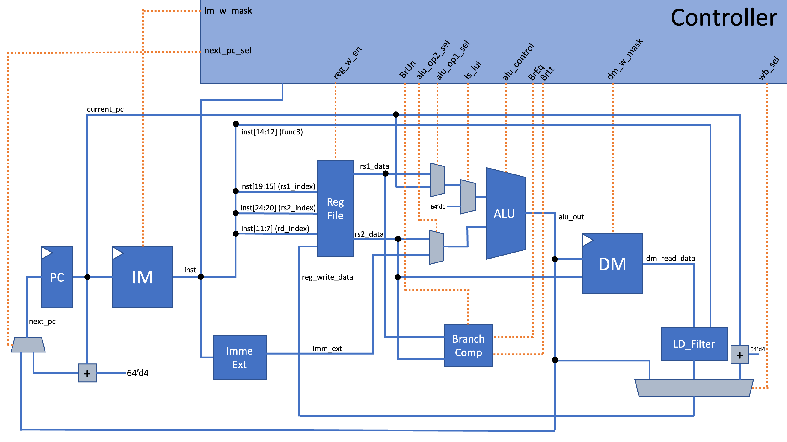
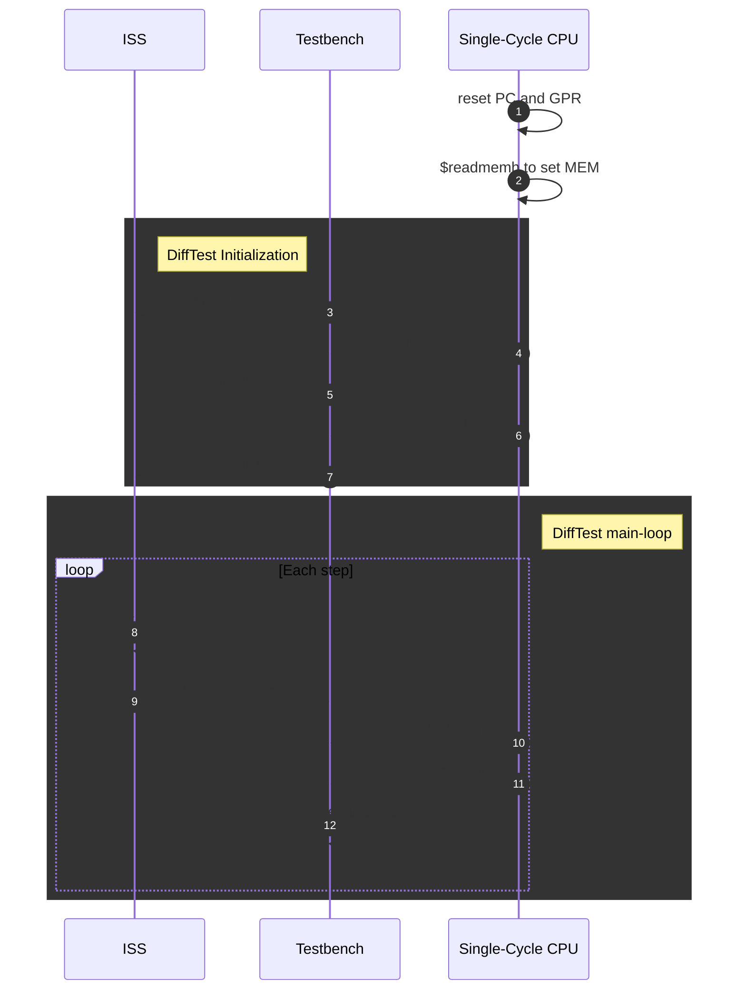
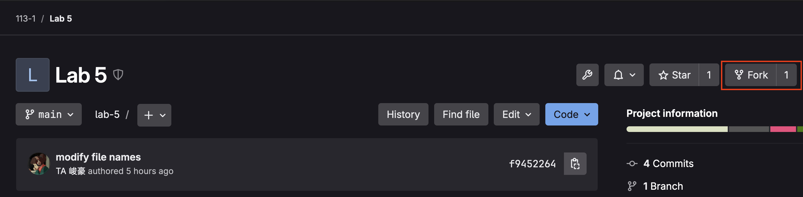
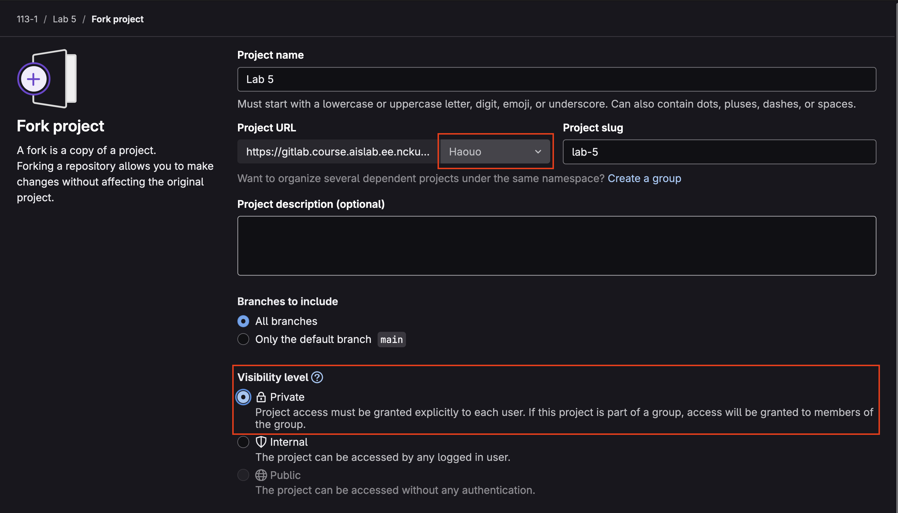

!!! info "Update information"
    - Contributor：TA 峻豪
    - Last update：2024/12/13

## From ISA Simulator to Read Hardware

在 Lab 2 中，我們透過 C 語言實作了一個 _ISA Simulator_，讓我們可以透過軟題來模擬指令集的層級的行為，屬於 Architecture Level 的探索。
但是，在這個 Lab 中，我們的目標是實作出一個實際的電路，而這個電路的功能是可以解析 RV64I 的指令並且執行對應的功能，因此我們必須思考怎麼樣的電路才能達成這個任務。

我們必須轉換我們的思維，在設計 ISS 的時候，我們的 design granularity 是 ___instruction-accurate___，但是在實際的數位電路中，電路是由時鐘訊號（clock）驅動，因此我們的電路的 design granularity 會是 ___clock-accurate___。
而在 Lab 5 中，我們的目標是實作 Single-Cycle CPU，Single-Cycle 意指我們必須要一個週期內完成取指（Instruction Fetch）、解碼（Instruction Decode）、執行（Execute）和寫回（Write-back）。

!!! note "Single-Cycle 的侷限性"
    大家仔細思考後應該可以發現，只要今天我們所實作的 CPU 讀取的記憶體，不論是 Instruction Memory 還是 Data Memory，如果它們無法在一個 Cycle 完成 Data Access，那麼我們的 Single-Cycle CPU 就會失效。
    如果我們今天所需的記憶體大小不大，我們或許可以直接使用一個小型的 Register Array 或是 FPGA 版上的 DUTRAM，那麼就可以支援 __Asynchronous Read__。
    但是，假設今天我們需要大一點的記憶體空間，可能就會需要用到真正專門的 Memory Element，譬如 FPGA 版上的 Block RAM (BRAM) 或甚至是外接 SD Card (Flash Memory)，這種記憶體就會是 __Synchronous Read__，
    至少需要兩個 clock cycle 才能拿到 read data（當前 cycle 傳入 address，下個 cycle 拿到資料）。

    遇到這種狀況的時候，我們可能就會需要將 Single-Cycle CPU 轉變為 Multi-Cycle CPU，才能夠應對 memory system 的 read/write latency，況且有時候 latency 甚至是不固定的！

## CPU Micro-architecture

!!! note "Architecture vs. Micro-architecture"
    **一個 Architecture (ISA) 可能會對應到多種可能的 Micro-architecture implementation**

    對於軟體工程師來說，通常他們所能接觸到關於整個計算機的細節的最底層就會是 ISA（暫時不討論關於 Performance Optimization），對於軟體工程師來說，他們只需要知道 CPU 支援哪些指令，他們就可以在這個平台之上去建構各式各樣的軟體。
    而對於設計 CPU 的工程師來說，他們大多時候能夠接觸到的關於系統中最上層的細節也會是 ISA（一樣不討論 Performance Optimization），他們不必須要知道這個 CPU 未來可能會被拿來執行哪些程式，他們只需要根據 ISA 手冊的規範將功能完整地實現就好。

    **為什麼說暫時不討論 Performance Optimization？**

    通常現實系統的開發往往會複雜很多，對於軟體工程師來說，如果要針對軟體效能做激進地優化，通常他們會需要知道 CPU 的 micro-architecture 細節，如 Cache Size，如此一來才可以設計出更佳 cache-friendly 的軟體，使效能更好。
    而對於 CPU Architect 來說，他們往往不會被侷限在 ISA-Level 底下，他們也會需要知道這個 CPU 未來可能會被拿來執行哪些程式（又稱為 <font color="red">__workload__</font>），他們需要做 workload analysis，並且根據分析後的結果，去調整 micro-architecture，目標也是為了讓 workload 在 CPU 上執行的效能更好。
    
    大家對這方面的議題感興趣的話，可以閱讀這篇文章：[我在 SiFive 處理器架構部門四年的經歷 by Zen](https://furuame.blogspot.com/2024/04/four-years-at-sifive.html#more)。

我們實作的 CPU 的微架構（micro-architecture）如下圖所示（可以右鍵點 <u>用新分頁開啟圖片</u> 看更大張的圖）

<figure markdown="span">
  
</figure>

我們分別探討 Single-Cycle CPU 中的每個 Module 的功能是什麼

### Package - DEF

首先，借助 SystemVerilog 相對於 Verilog 更強大的抽象能力，我們定義了一個 package `DEF`，裡面包含了我們需要用到的一些 data types。

```verilog linenums='1' title='DEF.sv'
package DEF;
    /* define width of double-word */
    typedef logic [63:0] dw;

    // ...

    typedef enum logic [1:0] {
        SEL_PC_PLUS_4,
        SEL_LOAD_DATA,
        SEL_ALU_OUT
    } wb_sel_t;

    /* RISC-V RV64I instruction formats (equivalent to 32-bit logic type) */
    typedef union packed {
        // R-type
        struct packed {
            logic [6:0] opcode;
            logic [4:0] rd;
            logic [2:0] func3;
            logic [4:0] rs1;
            logic [4:0] rs2;
            logic [6:0] func7;
        } R_TYPE;
        // I-type
        struct packed {
            logic [6:0]  opcode;
            logic [4:0]  rd;
            logic [2:0]  func3;
            logic [4:0]  rs1;
            logic [11:0] imm_11_0;
        } I_TYPE;
        // S-type
        struct packed {
            logic [6:0] opcode;
            logic [4:0] imm_4_0;
            logic [2:0] func3;
            logic [4:0] rs1;
            logic [4:0] rs2;
            logic [6:0] imm_11_5;
        } S_TYPE;
        // U-type
        struct packed {
            logic [6:0]  opcode;
            logic [4:0]  rd;
            logic [19:0] imm_31_12;
        } U_TYPE;
        // B-type
        struct packed {
            logic [6:0] opcode;
            logic imm_11;
            logic [3:0] imm_4_1;
            logic [2:0] func3;
            logic [4:0] rs1;
            logic [4:0] rs2;
            logic [5:0] imm_10_5;
            logic imm_12;
        } B_TYPE;
        // J-type
        struct packed {
            logic [6:0] opcode;
            logic [4:0] rd;
            logic [7:0] imm_19_12;
            logic imm_11;
            logic [9:0] imm_10_1;
            logic imm_20;
        } J_TYPE;
        logic [31:0] raw;
    } inst_t;

    /* instruction opcode map */
    typedef enum logic [6:0] {
        OP = 7'b0110011,
        OP_32 = 7'b0111011,
        OP_IMM = 7'b0010011,
        OP_IMM_32 = 7'b0011011,
        LOAD = 7'b0000011,
        STORE = 7'b0100011,
        BRANCH = 7'b1100011,
        JAL = 7'b1101111,
        JALR = 7'b1100111,
        AUIPC = 7'b0010111,
        LUI = 7'b0110111,
        SYSTEM = 7'b1110011
    } INST_OPCODE;

    /* arithmetic func3 map */
    typedef enum logic [2:0] {
        ADD_SUB_FUNC3 = 3'b000,
        SLL_FUNC3 = 3'b001,
        SLT_FUNC3 = 3'b010,
        SLTU_FUNC3 = 3'b011,
        XOR_FUNC3 = 3'b100,
        SRL_SRA_FUNC3 = 3'b101,
        OR_FUNC3 = 3'b110,
        AND_FUNC3 = 3'b111
    } ARITHMETIC_FUNC3;

    /* branch inst. func3 map */
    typedef enum logic [2:0] {
        BEQ_FUNC3  = 3'b000,
        BNE_FUNC3  = 3'b001,
        BLT_FUNC3  = 3'b100,
        BGE_FUNC3  = 3'b101,
        BLTU_FUNC3 = 3'b110,
        BGEU_FUNC3 = 3'b111
    } BRANCH_FUNC3;

    typedef enum logic [2:0] {
        SB_FUNC3 = 3'b000,
        SH_FUNC3 = 3'b001,
        SW_FUNC3 = 3'b010,
        SD_FUNC3 = 3'b011
    } STORE_FUNC3;

    typedef enum logic [2:0] {
        LB_FUNC3  = 3'b000,
        LH_FUNC3  = 3'b001,
        LW_FUNC3  = 3'b010,
        LD_FUNC3  = 3'b011,
        LBU_FUNC3 = 3'b100,
        LHU_FUNC3 = 3'b101,
        LWU_FUNC3 = 3'b110
    } LOAD_FUNC3;

    typedef enum logic [11:0] {
        ECALL_FUNC12  = 12'b000000000000,
        EBREAK_FUNC12 = 12'b000000000001
    } SYSTEM_FUNC12;
endpackage : DEF
```

### Module - PC

```verilog linenums='1' title='PC.sv'
module PC
    import DEF::*;
(
    input logic clk,
    input logic rst,
    input dw next_pc,
    output dw current_pc
);
    always_ff @(posedge clk or negedge rst) begin
        if (!rst) begin
            current_pc <= 64'd0;
        end else begin
            current_pc <= next_pc;
        end
    end
endmodule : PC
```

PC 這個 module 的功能只有一個，就是記錄著目前正在執行的指令的 memory address，也就是 Program Counter，並且在每個 Positive Edge 的時候更新 PC，將 `current_pc` 的值更新為輸入訊號 `next_pc`。

在模擬的最一開始，Testbench 會打入一個 asynchronous reset 訊號，並且我們的 PC 為 __asynchronous active-low reset__，而 PC 則會在這個時候被初始化成 0。

!!! note "Synchronous vs. Asynchronous Reset 之爭"
    大家對這個議題有興趣的話可以閱讀這兩篇論文，並且搜尋 _Reset Synchronizer_

    1. [Synchronous Resets? Asynchronous Resets? I am so confused! How will I ever know which to use?](http://www.sunburst-design.com/papers/CummingsSNUG2002SJ_Resets.pdf)
    2. [Asynchronous & Synchronous Reset Design Techniques - Part Deux](http://www.sunburst-design.com/papers/CummingsSNUG2003Boston_Resets.pdf)

### Module - RegFile

```verilog linenums='1' title='RegFile.sv'
module RegFile
    import DEF::*;
(
    input logic clk,
    input logic rst,
    input logic [4:0] rs1_index,
    input logic [4:0] rs2_index,
    input logic w_en,
    input logic [4:0] rd_index,
    input dw rd_data,
    output dw rs1_data,
    output dw rs2_data
);
    dw mem[32];  // register file
    always_ff @(posedge clk or negedge rst) begin
        if (!rst) begin
            for (int i = 0; i < 32; i++) begin
                mem[i] <= 64'd0;
            end
        end else begin
            if (rd_index != 5'd0 && w_en == 1'b1) begin
                mem[rd_index] <= rd_data;
            end
        end
    end
    /* assign output read data */
    assign rs1_data = mem[rs1_index];
    assign rs2_data = mem[rs2_index];
endmodule
```

RegFile 這個 module 最主要的功能就是作為 RISC-V CPU 中的 32 個 General Purpose Register (GPR)，

### Module - ImmExt

因為在計算的過程中，我們有可能會用到 Immediate 作為其中一個運算元（operand），因此，我們需要有一個專門的硬體模組來產生目前指令所相對應的 Immediate，而在我們的設計中該模組稱為 `ImmExt`（Immediate Extender）。

```verilog linenums='1' title='ImmExt.sv'
module ImmExt
    import DEF::*;
(
    input inst_t inst,
    output dw imm_ext_out
);
    logic [6:0] opcode;
    dw tmp_imm_ext_out;

    assign opcode = inst.R_TYPE.opcode;

    always_comb begin : main_block
        unique if (opcode == OP || opcode == OP_32 || opcode == SYSTEM) begin : noimm
            /* R-type and SYSTEM type */
            tmp_imm_ext_out = 64'd0;
        end : noimm
        else if (opcode == JAL) begin : jal
            /* J-type */
            tmp_imm_ext_out = {
                {44{inst.J_TYPE.imm_20}},
                inst.J_TYPE.imm_19_12,
                inst.J_TYPE.imm_11,
                inst.J_TYPE.imm_10_1,
                1'b0
            };
        end : jal
        else if (opcode == STORE) begin : store
            /* S-type */
            tmp_imm_ext_out = {
                {52{inst.S_TYPE.imm_11_5[6]}}, inst.S_TYPE.imm_11_5, inst.S_TYPE.imm_4_0
            };
        end : store
        else if (opcode == BRANCH) begin : branch
            /* B-type */
            tmp_imm_ext_out = {
                {52{inst.B_TYPE.imm_12}},
                inst.B_TYPE.imm_11,
                inst.B_TYPE.imm_10_5,
                inst.B_TYPE.imm_4_1,
                1'b0
            };
        end : branch
        else if (opcode == LUI || opcode == AUIPC) begin : u_type
            /* U-type */
            tmp_imm_ext_out = {{32{inst.U_TYPE.imm_31_12[19]}}, inst.U_TYPE.imm_31_12, 12'b0};
        end : u_type
        else begin : i_type
            /* I-type */
            /* includes OP_IMM, OP_IMM_32, LOAD, JALR*/
            tmp_imm_ext_out = {{52{inst.I_TYPE.imm_11_0[11]}}, inst.I_TYPE.imm_11_0};
        end : i_type
    end : main_block

    assign imm_ext_out = tmp_imm_ext_out;
endmodule
```

ImmExt 這個模組的主要功能就是根據目前指令的 format type 來產生對應的 sign-extended immediate，以便後面 ALU 做運算的時候可以使用。
大家可以發現當我們事先在 `DEF.sv` 中利用 `union packed` 配合 `struct packed` 去定義好六種不同的指令格式的 Bit-Field 之後，我們在 ImmExt 的實作中就可以利用 Bit-Field 來讓程式碼的**可讀性**更高。

除此之外，所有和指令格式相關的程式碼，只要我們都可以確實利用已經在 `DEF.sv` 中定義好的 Bit-Field 的話，即使我們在之後發現我們的 Bit-Field 定義有誤，
或甚至是 Spec 有更動（當然機率極低），就只需要更改 `DEF.sv` 中的程式碼即可，不用把所有相關的程式碼都修改一遍，可以大幅提高**可維護性**。

### Module - ALU

因為我們實作的指令集 RV64I 中包含了一般操作在 64-bit operand 上的指令，還有以 W 為後綴（suffix），只操作在 64-bit operand 的 lower 32-bit 的指令。
因此我們的 ALU 需要同時支援這兩種運算。我們針對 ALU 的控制訊號做了高度的抽象，讓我們的程式碼可讀性更高。

```verilog linenums='1' title='Part of DEF.sv'
/* opcode enumeration of ALU */
typedef enum logic [3:0] {
    ALU_OP_ADD,
    ALU_OP_SLL,
    ALU_OP_SLT,
    ALU_OP_SLTU,
    ALU_OP_XOR,
    ALU_OP_SRL,
    ALU_OP_OR,
    ALU_OP_AND,
    ALU_OP_SUB,
    ALU_OP_SRA
} alu_opcode_t;

typedef enum logic {
    ALU_OP_32,
    ALU_OP_64
} alu_op_width_t;

typedef struct packed {
    alu_opcode_t   alu_op;
    alu_op_width_t alu_width;
} alu_control_packet_t;
```

我們利用 enum 來枚舉 ALU 必須支援的運算類型還有寬度（Data Width），然後再利用 struct 把 `alu_opcode_t` 和 `alu_op_width_t` 包裝起來變成 `alu_control_packet_t`。

```verilog linenums='1' title='ALU.sv'
module ALU
    import DEF::*;  // import package DEF in module header
(
    input alu_control_packet_t alu_control,
    input logic [63:0] operand_1,
    input logic [63:0] operand_2,
    output logic [63:0] alu_out
);
    // TODO
endmodule : ALU
```

在 `ALU.sv` 中，我們要完成 ALU 實作。舉體來說，我們必須根據由 Controller 產生的控制訊號 `alu_control` 來決定該執行哪種類型的運算。
舉例來說，我們可以用以下的形式來描述 ALU 的行為（behhavior modeling）。

```verilog linenums='1' title='Example of implementing ALU addition'
function dw twos_complement(dw input);
    return (~input + 64'd1);
endfunction : twos_complement

dw pre_calaulate;

always_comb begin
    unique case (alu_control.alu_op)
        ALU_OP_ADD: begin
            pre_calculate = operand_1 + operand_2;
        end
        ALU_OP_SUB: begin
            pre_calculate = operand_1 + twos_complement(operand_2); 
        end
        // TODO: add more branches for this case statement to make the ALU complete
    endcase
end

assign alu_out = (alu_control.alu_width == ALU_OP_64) ? pre_calculate : {{32{pre_calculate[31]}}, pre_calculate};
```

### Module - BranchComp

當我們執行到 BRANCH 指令的時候（e.g., BEQ, BLT, ...），我們會需要**同時**處理兩個運算問題

1. 比較 rs1 和 rs2
    - BEQ
      > $\text{rs1} = \text{rs2}$ (sign is not important)
    - BNE
      > $\text{rs1} \neq \text{rs2}$ (sign is not important)
    - BLT
      > $\text{rs1}_{\text{signed}} < \text{rs2}_{\text{signed}}$
    - BLTU
      > $\text{rs1}_{\text{signed}} \ge \text{rs2}_{\text{signed}}$
    - BGE
      > $\text{rs1}_{\text{unsigned}} < \text{rs2}_{\text{unsigned}}$
    - BGEU
      > $\text{rs1}_{\text{unsigned}} \ge \text{rs2}_{\text{unsigned}}$
2. 計算 Branch Target Address<br>
    - $\text{PC} + \text{offset}$

如果以我們目前的 ALU 設計，只能同時輸入兩個 operands 並且執行一種運算，如此一來當我們要處理 BRANCH 指令的時候就會發生 __structural Hazard__。
所以除了有 ALU 以外，我們必須引入一個新的 module 叫做 Branch Comparator (BranchComp)，這個 module 用來處理 BRANCH 相關的**比較運算**，並且給出 Branch Result。

BranchComp 和 Controller 之間會有三個控制訊號，`BrUn` 由 Controller 產生，用來指示 BranchComp 應該要把 rs1 和 rs2 視為 signed 還是 unsigned，而 `BrEq` 和 `BrLt` 則由 BranchComp 產生，
用來告訴 Controller 比較運算的結果，讓 Controller 可以由 `BrEq` 和 `BrLt` 配合目前的 BRANCH 指令類型來判斷 Branch 是 Taken 還是 Not-taken。

!!! note "Example Case"
    舉例來說，假設目前執行的指令是 BGEU，則 Controller 應產生 `BrUn` 為 `1'b1`，而 BranchComp 則因此執行 unsigned comparasion。
    假設 rs1 為 `64'FFFFFFFFFFFFFF12`，而 rs2 為 `64'h0000000000000022`，則應產生 `BrEq` 為 `1'b0` 且 `BrLt` 為 `1'b0`。
    Controller 則根據目前指令為 BGEU 且 `BrLt` 為 `1'b0` 得知目前的 Branch Result 為 Taken，所以下一個週期應該跳轉到 $\text{PC} + \text{Offset}$。

```verilog linenums='1' title='intf.sv'
interface BranchCompControlIntf;
    /* signal bundle */
    logic BrUn, BrEq, BrLt;
    /* modports */
    modport ControllerSide(output BrUn, input BrEq, input BrLt);
    modport BranchCompSide(input BrUn, output BrEq, output BrLt);
endinterface : BranchCompControlIntf
```

我們利用 SystemVerilog 中的 interface 語法，將 Controller 和 BranchComp 之間的訊號連接封裝起來，並且利用 modport 語法來指令訊號的方向。

```verilog linenums='1' title='BranchComp.sv'
module BranchComp
    import DEF::*;
(
    input dw operand_1,
    input dw operand_2,
    BranchCompControlIntf.BranchCompSide control
);
    assign control.BrEq = (operand_1 == operand_2) ? 1'b1 : 1'b0;
    always_comb begin
        if (control.BrUn == 1'b0) begin
            control.BrLt = ($signed(operand_1) < $signed(operand_2)) ? 1'b1 : 1'b0;
        end else begin
            control.BrLt = (operand_1 < operand_2) ? 1'b1 : 1'b0;
        end
    end
endmodule
```

利用 interface 封裝訊號之後，我們在定義 `BranchComp` module 的時候，就可以直接用 `BranchCompControlIntf.BranchCompSide` 來宣告 Controller 和 BranchComp 之間的控制訊號。

### Module - LDFilte

我們的 CPU 支援的 LOAD 指令類型總共有七種，分別是 LB、LH、LW、LD、LBU、LHU 和 LWU，但是在我們的 Datapath 中，我們一次會直接從 Data Memory 中讀出 64-bit (double-word) 的數據，
因此，我們會需要一個特殊的 module 來對從 Data Memory 讀出的數據進行修改，以支援全部七種的 LOAD 指令類型，在這裡我們稱這個 module 為 __LOAD Filter__ (LDFilter)。

```verilog linenums='1' title='LDFilter.sv'
module LDFilter
    import DEF::*;
(
    input logic [2:0] func3,
    input dw in_data,
    output dw out_data
);
    always_comb begin
        unique case (func3)
            LB_FUNC3:  out_data = {{56{in_data[7]}}, in_data[7:0]};
            LH_FUNC3:  out_data = {{48{in_data[15]}}, in_data[15:0]};
            LW_FUNC3:  out_data = {{32{in_data[31]}}, in_data[31:0]};
            LD_FUNC3:  out_data = in_data;
            LBU_FUNC3: out_data = {56'd0, in_data[7:0]};
            LHU_FUNC3: out_data = {48'd0, in_data[15:0]};
            LWU_FUNC3: out_data = {32'd0, in_data[31:0]};
            default:   out_data = 64'd0;
        endcase
    end
endmodule
```

!!! question "The unique keyword"
    請思考為什麼在這裡我們會在 case statement 前面加上 `unique` 這個 keyword，對於 logic synthesis 有幫助嗎？
    如果把 `unique` 改成 `priority` 的話你覺得合適嗎？

### Module - Controller

```verilog linenums='1' title='Controller.sv'
module Controller
    import DEF::*;
(
    /* inst information */
    input inst_t inst,
    /* a0 and a1 for ECALL handle */
    input dw reg_a0,
    input dw reg_a1,
    /* next PC select */
    output next_pc_sel_t next_pc_sel,
    /* IM write control */
    output logic [7:0] im_w_mask,
    /* Register File Control */
    output logic reg_w_en,
    /* ALU control */
    output alu_op1_sel_t alu_op1_sel,
    output alu_op2_sel_t alu_op2_sel,
    output logic is_lui,
    output alu_control_packet_t alu_control,
    /* Branch Comparator control */
    BranchCompControlIntf.ControllerSide bc_control,
    /* DM write control */
    output logic [7:0] dm_w_mask,
    /* write-back select */
    output wb_sel_t wb_sel,
    /* halt signal (for testbench to monitor) */
    output logic halt
);
    // TODO: please implement Controller module

    /* ECALL handling */
    always_latch begin
        if (inst.I_TYPE.opcode == SYSTEM && inst.I_TYPE.imm_11_0 == ECALL_FUNC12) begin
            if (reg_a0 == 64'd0) begin : ECALL_to_halt
                halt = 1'b1;
            end : ECALL_to_halt
            else if (reg_a0 == 64'd1) begin : ECALL_to_putchar
                $display("%c", reg_a1[7:0]);
            end : ECALL_to_putchar
            else begin : ECALL_not_support
                $display("Not supported ECALL service request type!\n");
                $finish;
            end : ECALL_not_support
        end
    end
endmodule
```

Controller 幾乎可以說是整個 Single-Cycle CPU 中最重要的部分了，因為 Controller 負責產生各個 Module 和 Mux 的控制訊號，如果 Controller 無法正確地顫聲控制訊號的話，即使 Datapath 的設計沒問題，可能也會發生錯誤。

| **op\signals** | `next_pc_sel` | `im_w_mask` | `reg_w_en` | `alu_op1_sel` | `alu_op2_sel` | `is_lui` |       `bc_control`      |       `dm_w_mask`      |  `wb_sel` |
|:-------------------:|:-------------:|:-----------:|:----------:|:-------------:|:-------------:|:--------:|:-----------------------:|:----------------------:|:---------:|
|          OP         |      PC+4     |      0      |    True    |      rs1      |      rs2      |     0    |            X            |            0           |  alu_out  |
|        OP_32        |      PC+4     |      0      |    True    |      rs1      |      rs2      |     0    |            X            |            0           |  alu_out  |
|        OP_IMM       |      PC+4     |      0      |    True    |      rs1      |      rs2      |     0    |            X            |            0           |  alu_out  |
|      OP_IMM_32      |      PC+4     |      0      |    True    |      rs1      |      rs2      |     0    |            X            |            0           |  alu_out  |
|         LOAD        |      PC+4     |      0      |    True    |      rs1      |      imm      |     0    |            X            |            0           | Load data |
|        STORE        |      PC+4     |      0      |    False   |      rs1      |      imm      |     0    |            X            | Depends on STORE func3 |     X     |
|        BRANCH       | Branch Target |      0      |    False   |       PC      |      imm      |     0    | Depends on BRANCH func3 |            0           |     X     |
|         JAL         | Branch Target |      0      |    True    |       PC      |      imm      |     0    |            X            |            0           |    PC+4   |
|         JALR        | Branch Target |      0      |    True    |       PC      |      imm      |     0    |            X            |            0           |    PC+4   |
|        AUIPC        |      PC+4     |      0      |    True    |       PC      |      imm      |     0    |            X            |            0           |  alu_out  |
|         LUI         |      PC+4     |      0      |    True    |       0       |      imm      |     1    |            X            |            0           |  alu_out  |
|        SYSTEM       |      PC+4     |      0      |    False   |       X       |       X       |     X    |            X            |            0           |     X     |

至於 `clu_control` 的部分因為比較複雜，我們獨立出來分析

<div align="center" markdown>
| **op-type\signals** |   `alu_op`   | `alu_width` |
|:-------------------:|:------------:|:-----------:|
|          OP         |       ?      | `ALU_OP_64` |
|        OP_32        |       ?      | `ALU_OP_32` |
|        OP_IMM       |       ?      | `ALU_OP_64` |
|      OP_IMM_32      |       ?      | `ALU_OP_32` |
|         LOAD        | `ALU_OP_ADD` | `ALU_OP_64` |
|        STORE        | `ALU_OP_ADD` | `ALU_OP_64` |
|        BRANCH       | `ALU_OP_ADD` | `ALU_OP_64` |
|         JAL         | `ALU_OP_ADD` | `ALU_OP_64` |
|         JALR        | `ALU_OP_ADD` | `ALU_OP_64` |
|        AUIPC        | `ALU_OP_ADD` | `ALU_OP_64` |
|         LUI         | `ALU_OP_ADD` | `ALU_OP_64` |
|        SYSTEM       |       X      |      X      |
</div>

### Module - Memory

```verilog linenums='1' title='Memory.sv'
module Memory
    import DEF::dw;
(
    input logic clk,
    input logic [7:0] w_mask,
    input logic [15:0] address,
    input dw write_data,
    output dw read_data
);
    reg [7:0] mem[65536];  // register array to mimic DRAM

    /* main memory logic */
    always_ff @(posedge clk) begin
        unique0 if (w_mask == 8'b11111111) begin
            for (logic [15:0] i = 0; i < 8; i++) begin
                mem[address+i] <= write_data[8*i+:8];
            end
        end else if (w_mask == 8'b00001111) begin
            for (logic [15:0] i = 0; i < 4; i++) begin
                mem[address+i] <= write_data[8*i+:8];
            end
        end else if (w_mask == 8'b00000011) begin
            mem[address]   <= write_data[0+:8];
            mem[address+1] <= write_data[8+:8];
        end else if (w_mask == 8'b00000001) begin
            mem[address] <= write_data[0+:8];
        end
    end
    /* assign output read data */
    assign read_data = {
        mem[address+7],
        mem[address+6],
        mem[address+5],
        mem[address+4],
        mem[address+3],
        mem[address+2],
        mem[address+1],
        mem[address]
    };
endmodule
```

### Module - Core

```verilog linenums='1' title='Core.sv'
module Core
    import DEF::*;
(
    input  logic clk,
    input  logic rst,
    output logic halt
);
    // module instantiate and wire connect...
endmodule : Core
```

基本上 Core 這個 module 就是將 Datapath 中各個 components（包含 Controller）實例化，然後將將他們連接起來。
有一點要特別注意的是，在 CPU Block Diagram 中，有些多工器（Mux）我們是在 Core module 中才實作。

### Instruction Flow - 以 BEQ 指令為例

TBD

## Topics about Functional Verification (i.e., before synthesis)

### Introduction to Verilator

相較於 Verilator，大家應該更常聽到 Synopsys VCS 或是 Cadence XCELIUM 這兩個商業用的 Simulator，他們都可以用來模擬並且驗證我們設計的電路。
但是這兩個工具的缺點就是非常昂貴啊！是因為我們在台灣有 TSRI 的幫忙，在學校裡面才可以免費使用這兩個工具，不然一般人根本沒有機會用到。
所以為了不依賴商業工具，使這份教材可以推廣出去，我們改成使用 __Verilator__，一個完全開源（Open-Source）的 Verilog/SystemVerilog Simulator。

相較於 Icarus Verilog（a.k.a. iverilog），Verilator 最大的特點就是模擬速度很快，非常快（甚至比付費的 Simulator 還快），並且相對於 iverilog，Verilator 對於 SystemVerilog 有良好的支援。
除此之外，在工業上許多工時其實也會使用 Verilator 最爲早期的驗證工具（時間就是金錢！），所以可以知道 Verilator 並不是只是一個 toy project 而已。

#### How Verilator Works

> The verilator executable is invoked with parameters similar to GCC or other simulators such as Cadence Verilog-XL/NC-Verilog, or Synopsys VCS.
> Verilator reads the specified SystemVerilog code, lints it, optionally adds coverage and waveform tracing support, and compiles the design into a source-level multithreaded C++ or SystemC “model”.
> The resulting model’s C++ or SystemC code is output as .cpp and .h files. This is referred to as “==Verilating==”, andrthe process is “to ==Verilate==”; the output is a “Verilated” model.

### SystemVerilog DPI-C Mechanism

TBD

### Software/Hardware Co-Simulation - Differential Testing

還記得我們在 Lab 2 的時候設計了一個 ___instruction-driven___ 的 ISA Simulator (ISS) 嗎？之所以會叫大家在實際使用 HDL 撰寫 RTL-Level CPU 之前先用 C 語言刻出一個 ISS 是有原因的。
基本上，我們已經利用許多測試程式對我們的 ISS 做初步的驗證了，假設你的 ISS 有通過助教提供的所有測資的話，假設助教提供的測資集合為 $S$，我們可以假定，在我們只使用 $S$ 來進行測試的前提下，我們所實作的 ISS 可以作為 ___Reference Model (Golden Model)___。

大家應該都多少體驗過看波形地獄吧XD，但有了 ISS 之後，在我們設計 CPU 的時候，就可以做 __Co-Simulation__。
具體來說，Co-Simulation 指的是把我們的 ISS 和 Single-Cycle CPU 做 Co-sim，把 ISS 當作 Golden Model，然後去嘗試捕捉 CPU 的錯誤。
但有一個問題是，ISS 是用 C 語言實作的，而 CPU 則是用 SystemVerilog 實作的，而我們的 Testbench 則是混合了 SystemVerilog 還有 C++ 這兩種語言，這樣不同語言之間要怎麼樣才能做 co-sim 呢？
這就會需要使用到 SystemVerilog 的 DPI-C 機制。DPI-C 機制讓我們可以在 SystemVerilog 和 C 語言之間傳遞資訊，還有讓 SystemVerilog 呼叫 C Function，或是讓 C Program 呼叫 SystemVerilog Function/Task。

!!! info "DiffTest"
    其實這種 Co-Simulation 的方式並不少見，在業界已經是很常見的方法，而我們所用的這套 Differential Testing 框架其實是參考中國那邊幾個很有名的專案，大家可以參考以下資訊

    1. [一生一芯計畫](https://ysyx.oscc.cc/)
    2. [协同仿真框架 (DiffTest)](https://docs.xiangshan.cc/zh-cn/latest/tools/difftest/)

Differential Tstgin 這套框架本身有很多可以發展和優化的空間，但在這裡我們僅僅討論 DiffTest 最核心的概念，以及它該如何幫助我們更有效率地進行 __Design Verification__。
一般在我們直接看波形（Waveform）進行除錯的過程中，我們常常需要做的事情就是**定位第一個錯誤發生的時機**。直接使用波形除錯的好處就是需要的前置處理工作很少，在模擬結束後把波形 dump 出來就可以直接用工具來看波形。
這樣子的方式或許在我們的 Test Program 還很小的時候不會遇到太大的困難，但假如今天大家要跑的模擬程式是一個作業系統，動不動模擬就是上億個 Cycle 起跳的話，這時候只依賴波形就會變成一件不切實際的事情。

DiffTest 的概念是我們需要一個 Golden Model 作為參考答案，並且在**每條指令執行完之後都執行一次比對**，如此一來我們就可以在第一個出錯的瞬間捕捉到錯誤。
但有一個很重要的問題是，<font color="red">**我們應該要比對 Gloden Model 和 DUT 之間的什麼東西？**</font>
大家應該還記得我們在 Lab 2 裡面最一開始說的，CPU 本質上就是 Combitional Logic 加上 Sequantial Logic，可以被視為一個巨大的有限狀態機（FSM），對於指令的執行來說，我們可以比對的就是 CPU 的狀態！而 CPU 的狀態則由 PC、Register 和 Memory 所組成。

為了實現 DiffTest，具體來說我們需要幫我們的 Golden Model（也就是 Lab 2 實作的 ISS）加上幾個 API：

1. `void difftest_init(void)`
2. `viud difftest_get_current_pc(void *buf)`
3. `void difftset_get_regs(void *buf)`
4. `void difftest_set_regs(cosnt void* regs_from_dut)`
5. `void difftest_memcpy_from_dut(uint64_t addr, const void* buf, size_t mem_size)`
6. `void difftest_step(void)`
7. `void difftest_fini(void)`

再來，我們分析 `testbench.sv` 中關於 DiffTest 的部分（<font color="red">在 `testbench.sv` 中的 DPI-C function 的定義都在 `difftest.cpp` 中</font>）

```verilog linenums='1' title='Part of testbench.sv'
// defines
`define CYCLE 10
`define MAX_CLOCK_CYCLE 1000000
`define SO_FILE_NAME "iss/build/libiss.so"
`define IM core.im.mem
`define DM core.dm.mem
`define REGFILE core.regfile.mem
`define PC core.pc.current_pc

// DPI-C function declaration (8 functions in total)
import "DPI-C" function void difftest_init(input string so_file_name);
import "DPI-C" function void difftest_memcpy_from_dut(input logic [7:0] MEM[65536]);
import "DPI-C" function void difftest_get_current_pc(input logic [63:0] current_pc);
import "DPI-C" function void difftest_get_regs(input logic [63:0] regFile[32]);
import "DPI-C" function void difftest_set_regs();
import "DPI-C" function void difftest_check(inout bit success_flag);
import "DPI-C" function void difftest_step();
import "DPI-C" function void difftest_fini();

module testbench;
    // ...
    initial begin
        // ...
        // initialize difftest framework
        difftest_init(`SO_FILE_NAME);
        // copy register contents from dut to ref
        difftest_get_regs(`REGFILE);
        difftest_set_regs();
        // copy memory contents from dut to ref
        difftest_memcpy_from_dut(`DM);

        // difftest main loop
        do begin
            /* call difftest_step() */
            difftest_get_regs(`REGFILE);  // get register file of dut
            difftest_get_current_pc(`PC);  // get current PC of dut
            difftest_check(difftest_success_flag);
            difftest_step();  // make ref step one clock cycle
            #(`CYCLE);  // dut step one clock cycle
        end while (difftest_success_flag == 1'b1);
        // ...
    end
    // ...
endmodule
```

如果我們嘗試將 DiffTest 的運作流程視覺化，可以畫出下面這張圖（使用 _mermaid_ 繪製）

<center>

</center>

可以看到一開始 CPU 本身會先進行初始化，將自身的 GPR 和 PC 都重置，並且使用 SystemVerilog 中的 `$readmemh()` 系統函式來將 Data Memopry (DM) 和 Instruction Memory (IM) 初始化。
待 CPU 本身初始化完畢之後，就會進入 DiffTest 的 workdlow。最一開始，除了調用 `difftest_init()` 將 ISS 初始化之外，DiffTest 也要將 CPU 和 ISS 的 __Architectural States__ 進行同步 (PC and GPR)，對應到上方圖中的 DiffTest Initialization。
接下來就會進入 Difftest main-loop，在 main-loop 中 DiffTest 會首先呼叫 `ref_difftest_step()` 使 ISS 執行一條指令，之後在 `testbench.sv` 中的 `#(CYCLE)` 會使 simulation time 往後推進一個週期的時間，因此 CPU 也會執行一條指令。
之後就會得到 ISS 和 CPU 各自的 Architectural States 並且進行比較，檢查兩者狀態是否相同。

## Chapter 4. Start to Do The Assignment

### 4.1 Assignment Requirement

1. 請完成 Single-Cycle CPU 的實作
2. 通過所有的 `inst-tests` 和 `test-prog`
    - 確保程式執行結果正確
    - 確保執行完畢後通過 Differential Testing

### 4.2 Notes

1. Fork the repository the TA provide
    - 請先打開連結 [Lab 5](https://gitlab.course.aislab.ee.ncku.edu.tw/113-1/lab-5.git)
    - 點選右上角的 __Fork__
      <figure markdown="span">
        {width=850}
      </figure>
    - 進到下一個頁面後，把 __Project URL__ 的 __namespace__ 改成自己的學號，並且將 __Visibility Level__ 改成 __Private__
      <figure markdown="span">
        {width=850}
      </figure>
    - 按下最下面的 __Fork project__ 即可得到一份屬於自己私有的 Sample Code Repo
2. Clone your private repo
    - 先確定自己已經打開課程開發環境（Container），並且在環境中的 `workspace` 底下
    - 下載自己的 Private Repo（記得替換 <u><Your Student ID\></u>）
      > `git clone https://gitlab.course.aislab.ee.ncku.edu.tw/<Your Student ID>/lab-5.git`
    - 進入資料夾
      > `cd lab-5`
    - 對 Git Submodule 進行初始化
      > `git submodule init --recursive`
3. Notes
    - 因為在**預設**情況之下，只要 Gitlab Repo 中包含 `.gitlab-ci.yml` 檔案就會觸發 CI/CD Pipeline，如果你在前期尚未完成作業的時候不想觸發 Pipeline，可以先在 Gitlab 你的 Private Repo 中的設定將 CI/CD 功能關閉，待完成作業之後再打開
4. **請記得依據 [Assignment 5 Report Template](https://hedgedoc.course.aislab.ee.ncku.edu.tw/qQA5xz8oTd6e8zmskpIPsQ?view) 撰寫本次作業的報告，並且繳交報告連結到成大 Moodle 作業繳交區上**
