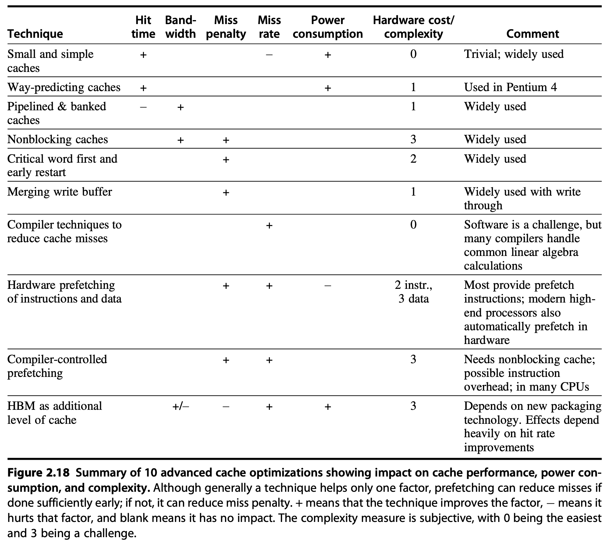

# Advanced Cache Optimizations

## Ten Advanced Cache Optimizations

### First Optimization: Small and Simple First-Level Caches to Reduce Hit Time and Power

### Second Optimization: Way Prediction to Reduce Hit Time

### Third Optimization: Pipelined Access and Multibanked Caches to Increase Bandwidth

### Fourth Optimization: Nonblocking Caches to Increase Cache Bandwidth

### Fifth Optimization: Critical Word First and Early Restart to Reduce Miss Penalty

### Sixth Optimization: Merging Write Buffer to Reduce Miss Penalty

### Seventh Optimization: Compiler Optimizations to Reduce Miss Rate

### Eighth Optimization: Hardware Prefetching of Instructions and Data to Reduce Miss Penalty or Miss Rate

### Ninth Optimization: Compiler-Controlled Prefetching to Reduce Miss Penalty or Miss Rate

### Tenth Optimization: Using HBM to Extend the Memory Hierarchy

### Summary of Ten Advanced Cache Optimizations

