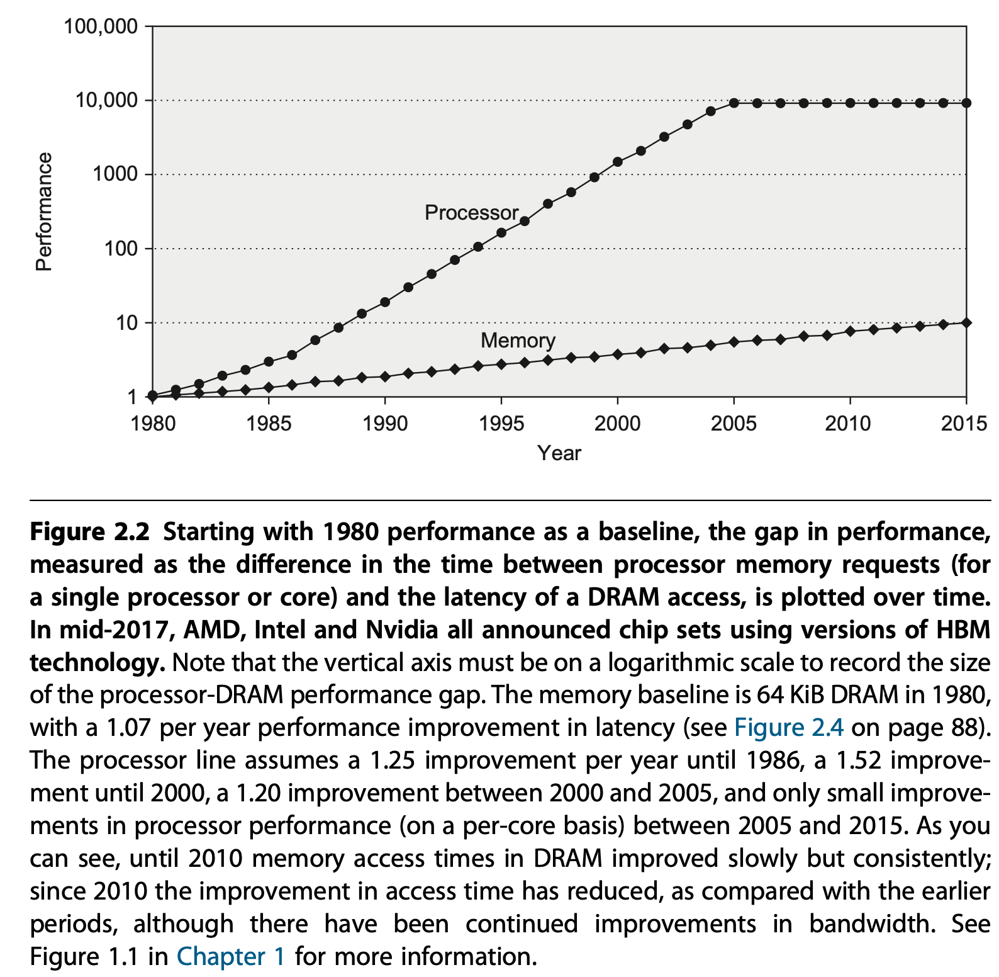
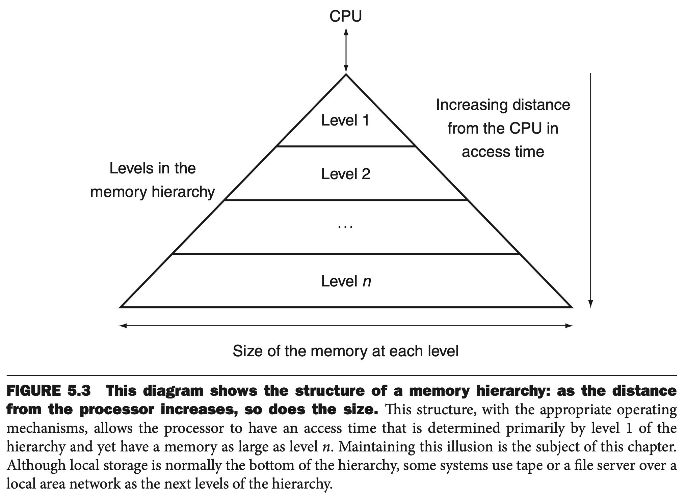

# Lab 8 - Deep Dive into Memory System

!!! info Update Info
    - Contributor: TA 峻豪
    - Last update: 2024/12/15

!!! note "What Every Programmer Should Know About Memory"
    本文的內容大量參考自 Ulrich Drepper 撰寫的論文 [What Every Programmer Should Know About Memory](https://people.freebsd.org/~lstewart/articles/cpumemory.pdf)，
    本論文亦有中文翻譯 [每位程式開發者都該有的記憶體知識](https://sysprog21.github.io/cpumemory-zhtw/)。

## Introduction to Memory Hierarchy

{width=65%}

{width=65%}

{width=65%}

