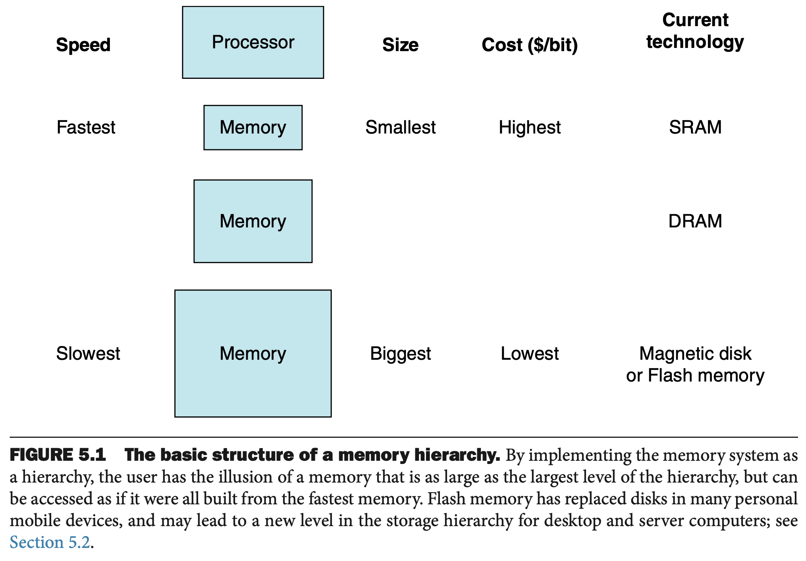

# Lab 8 - Deep Dive into Memory System

!!! info Update Info
    - Contributor: TA 峻豪
    - Last update: 2024/12/15

!!! note "What Every Programmer Should Know About Memory"
    本文的內容大量參考自 Ulrich Drepper 撰寫的論文 [What Every Programmer Should Know About Memory](https://people.freebsd.org/~lstewart/articles/cpumemory.pdf)，
    本論文亦有中文翻譯 [每位程式開發者都該有的記憶體知識](https://sysprog21.github.io/cpumemory-zhtw/)。

## Principle of Locality（局部性）

在介紹 Memory Hierarchy 之前，我們必須先探討所謂的 Locality（局部性）是什麼，這是構成 Memory Hierarchy 的基石。

> This _principle of locality_ underlies both the way in which you did your work in the library and the way that programs operate.
> The principle of locality states that programs access a relatively small portion of their address space at any instant of time, just as you accessed a very small portion of the library’s collection.

Locality 的特性，再加上硬體本身的特性，也就是通常在特定的製程技術和功耗限制下，越小的硬體可以越快，就促成了 Memory Hierarchy 的設計哲學。
利用分層次的記憶體系統，雖然越接近 Processor 本身的 Memory 容量越小，但是因為其存取速度更快，且得益於 Locality 的特性，依然可以有很好的 Performance。
如果今天程式本身沒有 Locality 的特性，可能就無法發揮 Memory Hierarchy 的優點。

### Temporal locality (Locality in time)

> if an item is referenced, it will tend to be referenced again soon.
> If you recently brought a book to your desk to look at, you will probably need to look at it again soon.

舉例來說，我們可能會在程式中定義某些常數（constant），這些常數可能會一直被重複讀取，這就展現了 temporal locality 的特性。

或是我們可以看下面這個陣列求和的例子

```cpp linenums='1' title='Array summation'
int a[5] = {1, 2, 3, 4, 5};
int sum = 0;

for(int i = 0; i < 5; i++){
    sum += a[i];
}
```

在上面的例子中，對於變數 `sum` 的存取模式便展現了 temporal locality 的特性。

### Spatial locality (Locality in space)

> if an item is referenced, items whose addresses are close by will tend to be referenced soon.
> For example, when you brought out the book on early English computers to learn about the EDSAC, you also noticed that there was another book shelved next to it about early mechanical computers,
> so you likewise brought back that book and, later on, found something useful in that book. Libraries put books on the same topic together on the same shelves to increase spatial locality.

當介紹 spatial locality 的時候，我們最常舉的例子就是 C 語言中的陣列（array），陣列在記憶體中的儲存方式是連續的，並且我們在操作陣列的時候往往會一次操作陣列中的多個元素，也因此可以很好地展現 spatial locality 的特性。

!!! question "Row-major vs. Column-major with perspective of locality"
    通常來說，多維陣列的 memory layout 在我們的記憶體系統當中通常是以 row-major 的方式儲存，在以 row-major 為儲存方式的前提假設以下，你覺得以下哪個版本的 function 效能更好？

    ```cpp linenums='1' title='Access in row-major'
    int a[5][5];
    for (int i = 0; i < 5; i++){
        for (int j = 0; j < 5; j++){
            a[i][j] = 5;
        }
    }   
    ```

    ```cpp linenums='1' title='Access in column-major'
    int a[5][5];
    for (int j = 0; j < 5; j++){
        for (int i = 0; i < 5; i++){
            a[i][j] = 5;
        }
    }  
    ```

## Introduction to Memory Hierarchy

在介紹 Random-Access Memory、Cache 和 Virtual Memory 之前，我們必須先來討論 Processor 和 Memory System 之間的 __Performance Gap__ 的變化。

<center>{width=65%}</center>

從上面這張圖我們可以看到雖然在過去十幾年 Processor 的效能增長的速度非常快，但是 Memory 的效能的成長速度卻相對緩慢，也因此導致 Processor 和 Memory 之間的效能差異越來越大。
效能差異大所帶來的問題是，Processor 的效能因為領先 Memory System 太多，也因此 Processor 可能常常需要花時間等待 Memory System 的回應，而並非真正地忙碌於計算任務上，這種現象又稱為 ___Memory-bound___，與之相反的則是 ___Compute-bound___。

<center>{width=65%}</center>

<center>{width=65%}</center>

## What We Gonna To Talk About

<center>{width=75%}</center>

在 Lab-8 當中，我們會介紹的部分主要涵蓋三個大主題

1. Ramdom-Access Memory (RAM), including Static RAM (SRAM) and Dynamic RAM (DRAM)
2. Cache Design, Performance Profiling and Optimization
3. Virtual Memory and Protection

等到大家學完 Lab 8 的所有內容之後，應該要對上面這張圖中的所有名詞都有基本的認識。
