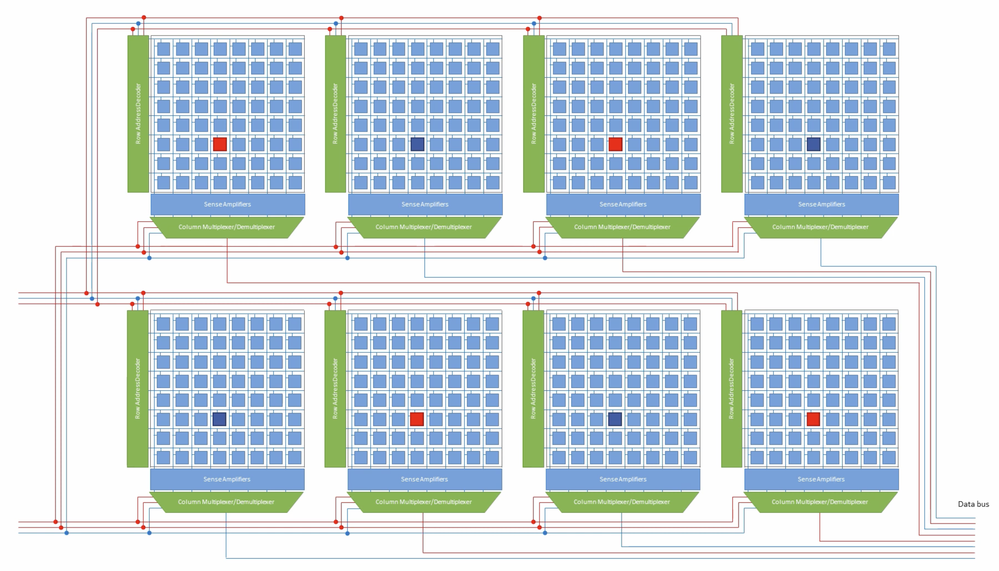

# Random Access Memory (RAM)

## RAM Types

> The first interesting details are centered around the question why there are different types of RAM in the same machine.
> More specifically, why are there both static RAM (SRAM) and dynamic RAM (DRAM). The former is much faster and provides the same functionality.
> Why is not all RAM in a machine SRAM? The answer is, as one might expect, cost. SRAM is much more expensive to produce and to use than DRAM.
> Both these cost factors are important, the second one increasing in importance more and more. To understand these differences we look at the implementation of a bit of storage for both SRAM and DRAM.
>
> ----- What Every Programmer Should Know About Memory, Chapter 2.1

常見的 RAM 主要分為兩種，分別是 SRAM 和 DRAM，以下我們將分別探討兩者的特性和各自的優缺點。

### Static RAM

<figure markdown="span">
    {width=50%}
</figure>

Static RAM 又常被稱為 SRAM，通常由六個 MOS 電晶體組成（也有其他使用更少電晶體的變種），當我們想要存取 SRAM Cell 中的資料的時候，只要拉高 $\text{WL}$ 的電位即可。
如果今天是要寫入 SRAM Cell 中，則需要先把 $\overline{\text{BL}}$ 和 $\text{BL}$ 這兩個線路設為想要的值，再提高 $\text{WL}$ 的電壓。

對於 SRAM 來說，有以下幾個重要的特性

1. 只要 $\text{V}_{\text{dd}}$ 維持供電，這樣 SRAM Cell 中保存的資料就不會消逝
    - 也因此代表如果要維持資料的話就必須保持供電，只要關閉電源資料就會不見，這一特性又稱為揮發性記憶體（___Volatile Memory___）。
2. 在提高 $\text{WL}$ 電位的同時，幾乎可以馬上取得 Cell 中的資料 

  > the cell state is available for reading almost im- mediately once the word access line WL is raised. The signal is as rectangular (changing quickly be- tween the two binary states) as other transistor- controlled signals.

3. 不同於 DARM，SRAM Cell 的狀態會一直維持穩定（因為沒有 leakage 效應），不需要 Refresh 操作

舉例來說，CPU 中最重要的狀態保存元件 Register File 就是由 SRAM 所組成，或是在數位電路中各式各樣的 Buffer 像是 Synchronous/Asynchronous FIFO 也通常是由 SRAM 所組成。

!!! note "Higher Level View of SRAM Cell"
    其實 SRAM 當中的 $\text{M}_1$ ~ $\text{M}_4$ 可以被視為兩個 ___cross-coupled inverters___ 組成，這種組合有一種特性 ___bi-stable___。
    也就是這對 cross-coupled inverters 一定會保持在 $(1, 0)$ 或是 $(0, 1)$ 這兩種狀態的其中一種，只要維持 $\text{V}_{\text{DD}}$ 的供電即可，也因此可以被用來儲存 bit 0 或 1。

    <figure markdown="span">
    
    <figcaption>Transistor-level schematic of inveter (static CMOS)</figcaption>
    </figure>

### Dynamic RAM

Dynamic RAM 又稱為 DRAM，其單位 DRAM Cell 結構上通常由一個電晶體加上一個電容所阻成（1T1C structure），光是在電路複雜度上我們就可以看出 DRAM 相較於 SRAM 要簡單太多，但也意味著 SRAM 和 DRAM 有著巨大的性質差異。

{width=50%}
{width=30%}

DRAM Cell 使用其中的電容 $C$ 來保存資料，並且利用電晶體控制資料的存取。當我們要讀取資料的時候，必須將 Access Line（$\text{AL}$）的電位拉高，使得電晶體 $\text{M}$ 導通，此時電流有可能會流向 Data Line（$\text{DL}$），這取決於電容內部的電量。
如果要把資料寫進 DRAM Cell 中，則必須適當地設置 Data Line，並且將 Access Line 的電位拉高__足夠長地時間__，以讓電容正確地充放電。

不過 DRAM 在設計上其實有很多難題必須要考量

1. 當我們讀取 DRAM Cell 時，無可避免地會使得電容放電而導致資料的流失，因此必須在某個時間點上對電容進行充電（Refresh），並且當今的 DRAM Chip 為了容納龐大數量的 DRAM Cell，使得電容本身的電容值通常只有 femto-farad 甚至更小，並且電容存在漏電（leakage）的問題
    - 這種 leakage 使得現今大部分的 DRAM 晶片必須每經過 64 毫秒就要重新充電
2. 因為電容本身所帶的電量非常微小（受限於電容值），所以我們讀取的到資訊並不能直接使用，而是必須經過感測放大器（sense amplifier）
3. 因為讀取會消耗電容電量，因此讀取操作必須伴隨著對電容重新充電的操作，造成額外的電力消耗，更重要的是額外的時間延遲
4. 因為電容的充放電並不是瞬間完成，也因此造成 sense amplifier 必須使用一個謹慎的估計，來決定在什麼時候可以使用 DRAM Cell 的輸出

<figure markdown="span">
    {width=50%}
    <!-- <figcaption>電容充電與放電時間的電量對時間關係圖</figcaption> -->
</figure>

相較於 SRAM 可以立即得到輸出結果，DRAM 有著更高的延遲。
不過 DRAM 最大的優勢就是__成本低__，在同樣的晶片面積中，我們往往可以塞下多上數倍的 DRAM Cell，這也就意味著更大的儲存空間，也因此通常我們必須採用 DRAM 作為我們的主記憶體（main memory）。

## Basic DRAM Organization

{width=80%}

最基本的 DRAM 內部結構由一個 Memory Array、Row Decoder、Column Decoder、Sense Amplifier 和 I/O Buffer 所組成。
Memory Controller 藉由指定 row address 和 column address 就可以存取 memory array 中的單一一個 DRAM cell 的資料。

{width=80%}

不過，我們使用 row address 和 column address 去對__單一個__ memory array 進行讀取操作的時候只能得到一個 bit，這樣的做法相當浪費頻寬，也因此我們大多時候都會同時操作多個 memory array，而多而 memory array 為一個集合的單位又被稱作是 ___bank___。
舉例來說，一個 x8 DRAM（by-eight DRAM）代表一個 bank 中會有八個相同的 memory array，並且這八個 memory array 共享 row/column address 還有控制訊號，這樣在讀取的時候，就可以從一個 bank 當中得到一個 byte (8-bit) 的資料。
除此之外，通常一個 DRAM Memory Chip（一個 DRAM Module 上面看到的一片黑色的 memory chip）會由多個__獨立運作的__ bank 組成，這樣做的好處是當其中一個 bank 處於忙碌狀態的時候，就可以對其他處於 idle 狀態的 bank 進行操作，這個技術又稱為 ___bank interleaving___。

{width=80%}

從上面這張示意圖我們可以看到，這是一個 x8 configuratioin，表示一個 bank 可以提供 8-bit 的資料。在一個 bank 中有八個 memory array，他們的 row/column address 的訊號來源都是相同的，但是各自提供 1-bit 的資料，也因此 Data bus 上的每個 bit 分別來自各個 memory array。

{width=80%}

截至目前，我們知道一個 Memory Chip 之中可能會有多個__獨立的__ banks 組成，這些獨立的 bank 之間的運作可以被 __interleaved__，用來提高 DRAM System 的 throughput。
但是 DIMM Interface 可以支援的傳輸頻寬是 64-bit，所以我們一次只讀取一個 byte 的資料依然還是只使用了八分之一的頻寬，因此，我們可能會將多個 DRAM Chip __再次並聯__，
舉例來說，假設我們使用的是 x8 (by-eight) DDR Chip，表示每次讀取一個 Chip 可以提供 8-bit 的資料，那我們就可以將八個 x8 Chip 並聯，這樣就可以一次讀取到 $8 \times 8 = 64$ bits 的資料，這樣將八個 Chip 並聯起來形成的新單位又稱為 ___rank___。
每組 rank 中由多個 DRAM Chip 組成，一組 rank 中的所有 DRAM Chip 會__同時__響應由 controller 發出的命令。
換句話說，假設改成使用 x4 DRAM Chip 並且一樣使用 DIMM Interface 的話，那我們就必須要並聯十六個 x4 DRAM Chip 才可以滿足 DIMM 的頻寬需求，也因此我們會在單一個 DRAM Module 上面看到十六個黑色的 DRAM Chip。

!!! note "名詞：DRAM Module"
    白話一點來說，DRAM Module 指的就是家用電腦主機板上一條一條的 DRAM

最後，DRAM System 中可能會有多個 ___channel___，每個 channel 都必須有自己獨立的 memory controller，舉例來說，我們常常聽到的 _雙通道記憶體配置_ 就是所謂的 ___dual-channel configuration___，指的是系統中有兩個獨立的 memory controller 對應到兩個 DRAM channel。
理論上來說雙通道配置可以提升 bandwidth，但是往往會受限於資料實際在 DRAM 中的擺放方式，所以效能並不總是無條件地變好。

我們整理一下 DRAM 系統的 Address Hierarchy，由上到下分別為

1. Channel Address
2. Rank Address
3. Bank Address
4. Row Address
5. Column Address

通常 __Physical Address (Logical Address)__ 會必須經由 DRAM Ctroller 進行 __Address Mapping__ 來轉換成 DRAM 實際的各種 address。
基本上 address mapping 的方式也是 DRAM System 中的一個研究主題之一，因為不同的 mapping 方式也會影響 DRAM 整體的讀取性能，這部分我們留待後面再詳細介紹。

!!! note "SIMM and DIMM"
    TBD

在實際的系統當中，CPU 並不是直接連接到 DRAM 本身，而是連接到 DRAM Controller，再由 DRAM Controller 負責對 DRAM 進行操作。

{width=50%}

如同前面所述，因為 DRAM Cell 中的電容值非常的小，所以我們必須使用 Sense Amplifier 來放大微小的變化以對應到實際的 logic level。
具體來說，在進行讀取之前，memory array 中的某個

{width=75%}

### Basic Sense Amplifier Operation

{width=80%}

深入分析 Read Operation 在實際的 DRAM 電路上的運作，主要可以分成四個階段，分別是 Precharge、Access、Sense 和 Restore。

{width=75%}

{width=80%}

## Generic DRAM Access Protocol

要介紹 CPU 到底是如何讀取 DRAM 的話，我們必須從 Controller 如何和 DRAM 本身互動來討論。
基本上，DRAM Controller (DMC) 是透過一系列操控 DRAM 的指令（command）來和 DRAM 進行互動，我們首先先來探討 Generaic DRAM System 中究竟有哪些用來控制和操作 DRAM 的指令。

### Bank/Row-Active Command (ACTIVE Command)

在實際進行讀寫之前，我們必須要先把我們要進行存取的 Row __打開__，具體來說就是將 Row Address 傳入並且使 Sense Amplifier 去 latch 某個 row 的所有 data，稱為 ___Bank Activation___ 或是 ___Row Activation___。

> Before any READ or WRITE commands can be issued to a bank within the DDR SDRAM, a row in that bank must be ”opened.” This is accomplished via the ACTIVE command (Figure 8), which selects both the bank and the row to be activated.
>
> After opening a row (issuing an ACTIVE com- mand), a READ or WRITE command may be issued to that row, subject to the tRCD specification.
>
> A subsequent ACTIVE command to a different row in the same bank can only be issued after the previous active row has been ”closed” (pre- charged). The minimum time interval between successive ACTIVE commands to the same bank is defined by tRC.
>
> A subsequent ACTIVE command to another bank can be issued while the first bank is being ac- cessed, which results in a reduction of total row-access overhead. The minimum time interval be- tween successive ACTIVE commands to different banks is defined by tRRD.
>
> --- JESD79F[^1]

當 DRAM Controller 發出 ACTIVE 指令後，會使特定 bank 中的某個 row 中的全部 column cell 的資料流向 Sense Amplifier 並且被 Sense Amplifier 中的 Latch 儲存。

### Column-Read Commanda (READ Command)

### Column-Write Command (WRITE Command)

### Precharge Command

    {width=80%}
    <figcaption>Simplified state diagram of DDR1</figcaption>

上圖是 DDR1 的簡化狀態機，可以看到在我們剛啟動 DRAM 的時候，就會先對所有 bank 中的所有 Row 進行 Precharge，接下來才會進入 Idle 狀態，等待 DRAM Controller 發出後續的指令。
當特定 bank 中的特定 row 收到 ACTIVE 指令之後，就會進入 Row Active 狀態，等待接續的 READ/WRITE 指令，並且當完成 read/write 之後，就必須等待 DMC 發出 Precharge 指令，完成 Precharge 之後才會回到 Idle 狀態並且等待下一個 read/write cycle。

> The PRECHARGE command is used to __deactivate__ the open row in a particular bank or the open row in all banks. The bank(s) will be available for a subsequent row access some specified time (tRP) after the precharge command is issued.
> Input A10 determines whether one or all banks are to be precharged, and in the case where only one bank is to be precharged, inputs BA0, BA1 select the bank. When all banks are to be precharged, inputs BA0, BA1 are treated as ”Don’t Care.”
> Once a bank has been precharged, it is in the idle state and must be activated prior to any READ or WRITE commands being issued to that bank.
>
> --- JESD79F[^1]

還記得前面我們介紹 Sense Amplidier 運作的時候提到，一個 read cycle 在 DRAM 中的運作基本上可以分成 Precharge、Acess、Sense 和 Restore，讓我們現在假設第一個動作 Precharge 已經在 DRAM 啟動並初始化的時候完成了，
接下來當我們完成 Access、Sense 和 Restore 之後，目前的 $\text{Bitline}$ 和 $\overline{\text{Bitline}}$ 電位分別是 $\text{V}_{\text{CC}}$ 和 0。
也因此我們應該要將 Bitline 的電位透過 Precharge 指令恢復，才可以回到 Idle 狀態並且等待下一個 read/write cycle。

!!! note "白話文解釋"
    一個 Bank 要能接受 READ/WRITE 指令之前應該要被 activated，也就是利用 ACTIVE 指令將 bank 中的某個 row “打開”，然後在接受下一個 ACTIVE 指令之前，必須要使用 Precharge 指令來使該 bank 被 deactivated，也就是將該 bank 中本來被 “打開” 的 row “關閉”。

### Refresh Command

Refresh 指令是為了解決我們最一開始提到的 Leakage Problem。

## DDR Prefetch and Burst

在 SDRAM 的領域中，__Prefetch__ 和 __Burst__ 的概念在 DDR1 的規格中首次被提出，主要目的是為了提升 DDR 的 bandwidth。

## Address Mapping

即使 CPU 使用 Virtual Address 作為 LOAD/STORE 指令的 address，但是在 CPU 把 memory request 送到 DRAM Controller 之前，會先經過 Memory Manage Unit (MMU) 轉換成 Physical Address 後才會送到 DMC。
因為 DRAM 在 Address Hierarchy 上分成了 Channel、Rank、Bank 和 Row/Column，所以自然而然就衍生了一個問題，那就是如何把經過 MMU 轉換的 Physical Address 映射為實際 DRAM 可以使用的 DRAM Address。
也就是我們必須要思考如何將 64-bit 或是 32-bit 的 Physical Address 切分成五個部分，分別對應到 Channel Address、Rank Address、Bank Address、Row Address 和 Column Address。__Address Mapping 的設計方式會對 DRAM Performance 有非常大的影響！__

!!! note "參考資料"
    大家可以參考這篇文章：[What's in an Address: Understanding DDR Memory Mapping](https://depletionmode.com/ram-mapping.html)

## Ramulator2.0 - A Modern, Modular and Extensible DRAM Simulator

Ramulator 2.0 是由蘇黎世聯邦理工學院的教授 Onur Mutlu 所帶領的研究團隊設計的一個 DRAM Simulator，可以模擬多種類型 DRAM 的精確行為（cycle-accurate）除了常見的 DDR3、DDR4、DDR5 以外，甚至也可以模擬 HBM。

在 ramulator2 中，主要由一個 Ftont-end 和 Memory System (backend) 所構成，其中 memory system 又可以細分成

## Appendix - RowHammer DRAM Vulnerability

!!! info "Papers about RowHammer"
    __參考論文__

    1. [Yoongu Kim, Ross Daly, Jeremie Kim, Chris Fallin, Ji Hye Lee, Donghyuk Lee, Chris Wilkerson, Konrad Lai, and Onur Mutlu. 2014. __Flipping bits in memory without accessing them: an experimental study of DRAM disturbance errors.__ In Proceeding of the 41st annual international symposium on Computer architecuture (ISCA '14). IEEE Press, 361–372.](https://dl.acm.org/doi/10.1145/2678373.2665726)
    2. [Onur Mutlu, Ataberk Olgun, and A. Giray Yağlıkcı. 2023. __Fundamentally Understanding and Solving RowHammer.__ In Proceedings of the 28th Asia and South Pacific Design Automation Conference (ASPDAC '23). Association for Computing Machinery, New York, NY, USA, 461–468](https://doi.org/10.1145/3566097.3568350) 

RowHammer 是目前 DRAM 系統中普遍存在的一個硬體漏洞 (___vulnerability___)，並且隨著 DRAM Technology 的進展，這個問題變得越來越嚴重且不可忽視。

<!-- footnote contents -->
[^1]:
    [DOUBLE DATA RATE (DDR) SDRAM STANDARD - JESD79F](https://www.jedec.org/standards-documents/docs/jesd-79f)

    各個世代的 DDR 規格都是由 JEDEC Solid State Technology Association 制定的。除此之外，High Bandwidth Memory (HBM) 的規格也是由 JEDEC 制定。
