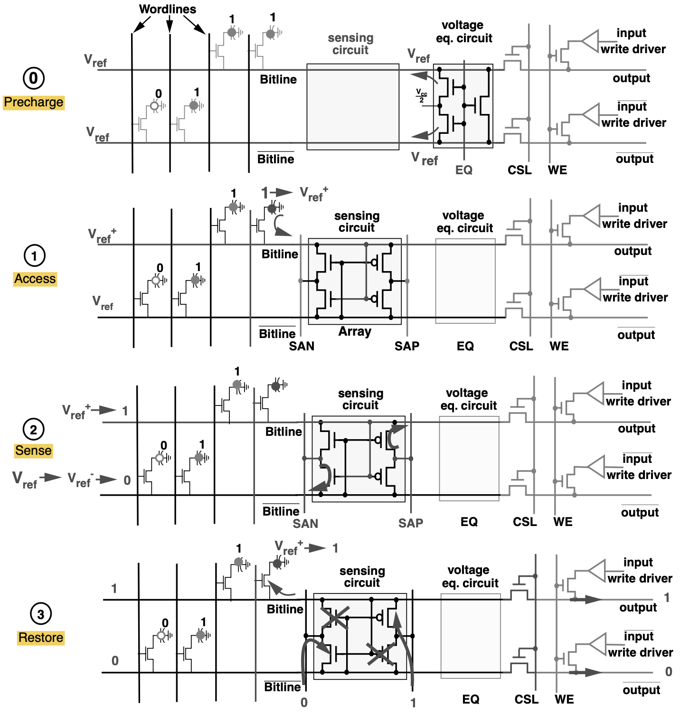
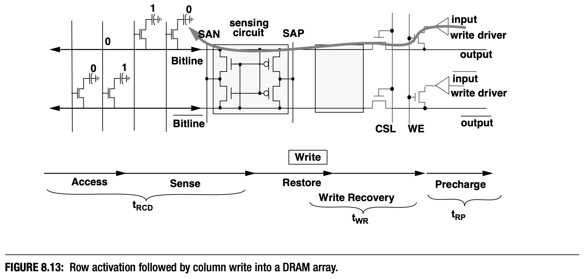

# Random Access Memory

## RAM Types

> The first interesting details are centered around the ques-tion why there are different types of RAM in the samemachine.
> More specifically, why are there both static RAM (SRAM) and dynamic RAM (DRAM). The former is much faster and provides the same functionality.
> Why is not all RAM in a machine SRAM? The answeris, as one might expect, cost. SRAM is much more expensive to produce and to use than DRAM.
> Both thesecost factors are important, the second one increasing inimportance more and more. To understand these differ-ences we look at the implementation of a bit of storagefor both SRAM and DRAM.
>
> ----- What Every Programmer Should Know About Memory, Chapter 2.1

常見的 RAM 主要分為兩種，分別是 SRAM 和 DRAM，以下我們將分別探討兩者的特性和各自的優缺點。

### Static RAM

<figure markdown="span">
    {width=50%}
</figure>

Static RAM 又常被稱為 SRAM，通常由六個 MOS 電晶體組成（也有其他使用更少電晶體的變種），當我們想要存取 SRAM Cell 中的資料的時候，只要拉高 $\text{WL}$ 的電位即可。
如果今天是要寫入 SRAM Cell 中，則需要先把 $\overline{\text{BL}}$ 和 $\text{BL}$ 這兩個線路設為想要的值，再提高 $\text{WL}$ 的電壓。

對於 SRAM 來說，有以下幾個重要的特性

1. 只要 $\text{V}_{\text{dd}}$ 維持供電，這樣 SRAM Cell 中保存的資料就不會消逝
    - 也因此代表如果要維持資料的話就必須保持供電，只要關閉電源資料就會不見，這一特性又稱為揮發性記憶體（Volatile Memory）。
2. 在提高 $\text{WL}$ 電位的同時，幾乎可以馬上取得 Cell 中的資料 
  > the cell state is available for reading almost im- mediately once the word access line WL is raised. The signal is as rectangular (changing quickly be- tween the two binary states) as other transistor- controlled signals.
3. 不同於 DARM，SRAM Cell 的狀態會一直維持穩定，不需要 Refresh 操作

舉例來說，CPU 中最重要的狀態保存元件 Register File 就是由 SRAM 所組成，或是在數位電路中各式各樣的 Buffer 像是 Synchronous/Asynchronous FIFO 也通常是由 SRAM 所組成。

!!! note "SRAM and SR-Latch"
    其實 6-T SRAM 中的兩個 cross-coupled inverters 就相當於 SR-Latch，而電晶體 $\text{M}_5$ 和 $\text{M}_6$ 則是用來控制 $\text{BL}$ 和 $\overline{\text{BL}}$ 這兩個輸入的開關（switch）。

### Dynamic RAM

Dynamic RAM 又稱為 DRAM，其單位 DRAM Cell 結構上通常由一個電晶體加上一個電容所阻成（1T1C structure），光是在電路複雜度上我們就可以看出 DRAM 相較於 SRAM 要簡單太多，但也意味著 SRAM 和 DRAM 有著巨大的性質差異。

{width=50%}
{width=30%}

DRAM Cell 使用其中的電容 $C$ 來保存資料，並且利用電晶體控制資料的存取。當我們要讀取資料的時候，必須將 Access Line（$\text{AL}$）的電位拉高，使得電晶體 $\text{M}$ 導通，此時電流有可能會流向 Data Line（$\text{DL}$），這取決於電容內部的電量。
如果要把資料寫進 DRAM Cell 中，則必須適當地設置 Data Line，並且將 Access Line 的電位拉高**足夠長地時間**，以讓電容正確地充放電。

不過 DRAM 在設計上其實有很多難題必須要考量

1. 當我們讀取 DRAM Cell 時，無可避免地會使得電容放電而導致資料的流失，因此必須在某個時間點上對電容進行充電（Refresh），並且當今的 DRAM Chip 為了容納龐大數量的 DRAM Cell，使得電容本身的電容值通常只有 femto-farad 甚至更小，並且電容存在漏電（leakage）的問題
    - 這種 leakage 使得現今大部分的 DRAM 晶片必須每經過 64 毫秒就要重新充電
2. 因為電容本身所帶的電量非常微小（受限於電容值），所以我們讀取的到資訊並不能直接使用，而是必須經過感測放大器（sense amplifier）
3. 因為讀取會消耗電容電量，因此讀取操作必須伴隨著對電容重新充電的操作，造成額外的電力消耗，更重要的是額外的時間延遲
4. 因為電容的充放電並不是瞬間完成，也因此造成 sense amplifier 必須使用一個謹慎的估計，來決定在什麼時候可以使用 DRAM Cell 的輸出

<figure markdown="span">
    {width=50%}
    <!-- <figcaption>電容充電與放電時間的電量對時間關係圖</figcaption> -->
</figure>

相較於 SRAM 可以立即得到輸出結果，DRAM 有著更高的延遲。
不過 DRAM 最大的優勢就是**成本低**，在同樣的晶片面積中，我們往往可以塞下多上數倍的 DRAM Cell，這也就意味著更大的儲存空間，也因此通常我們必須採用 DRAM 作為我們的主記憶體（main memory）。

## Basic DRAM Organization

{width=80%}

最基本的 DRAM 內部結構由一個 Memory Array、Row Decoder、Column Decoder、Sense Amplifier 和 I/O Buffer 所組成。
Memory Controller 藉由指定 row address 和 column address 就可以存取 memory array 中的單一一個 DRAM cell 的資料。

{width=80%}

不過，我們使用 row address 和 column address 去對**單一個** memory array 進行讀取操作的時候只能得到一個 bit，這樣的做法相當浪費頻寬，也因此我們大多時候都會同時操作多個 memory array，而多而 memory array 為一個集合的單位又被稱作是 ___bank___。
舉例來說，一個 x8 DRAM（by-eight DRAM）代表 memory controller 每次讀取 DRAM 的時候，我們會使用同一個 row/column address 同時對八個 memory array 發出讀取請求，這樣我們就會得到一個 byte 的資料。
除此之外，通常一個 Chip（一條 DRAM 上面看到的一片黑色 memory chip）會由多個**獨立的** bank 組成，這樣做的好處是當其中一個 bank 處於忙碌狀態的時候，就可以對其他處於 idle 狀態的 bank 進行操作。

{width=80%}

但是 DIMM 可以支援的傳輸頻寬是 64-bit，所以我們一次只讀取一個 byte 的資料依然還是只使用了八分之一的頻寬，因此我們還會將多個

!!! note "SIMM and DIMM"
    TBD

在實際的系統當中，CPU 並不是直接連接到 DRAM 本身，而是連接到 DRAM Controller，再由 DRAM Controller 負責對 DRAM 進行操作。

{width=50%}

如同前面所述，因為 DRAM Cell 中的電容值非常的小，所以我們必須使用 Sense Amplifier 來放大微小的變化以對應到實際的 logic level。
具體來說，在進行讀取之前，memory array 中的某個

{width=75%}

### Basic Sense Amplifier Operation

{width=80%}

深入分析 Read Operation 在實際的 DRAM 電路上的運作，主要可以分成四個階段，分別是 Precharge、Access、Sense 和 Restore。

{width=75%}

{width=80%}

## DRAM Access Technical Details

<figure markdown="span">
    {width=50%}
</figure>

<figure markdown="span">
    {width=50%}
</figure>

## Ramulator2.0 - A Modern, Modular and Extensible DRAM Simulator

TBD
