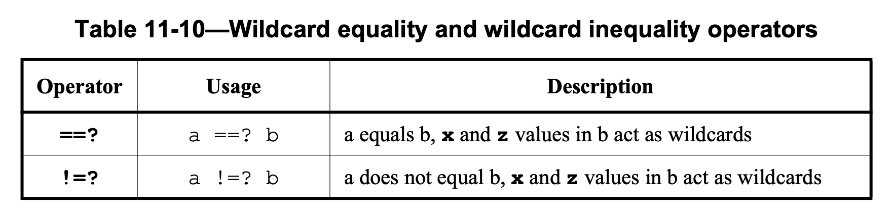

!!! info
    - Contributors: TA 峻豪
    - Last updated: 2024/11/30

---

!!! success "Recommend Reading List"
    1. 推薦閱讀論文 [Synthesiing SystemVerilog - Busting the Myth that SystemVerilog is only for Verification](https://sutherland-hdl.com/papers/2013-SNUG-SV_Synthesizable-SystemVerilog_paper.pdf)，該論文詳細地介紹了 SystemVerilog 對於電路設計的好用之處。
    2. 心有餘力的話，能夠看過 SystemVerilog 的**規格書**當然是最好的：[1800-2023 - IEEE Standard for SystemVerilog--Unified Hardware Design, Specification, and Verification Language](https://ieeexplore.ieee.org/document/10458102)
        - Ps：透過成大校內的網路應該可以查看 PDF 檔案

## What is  SystemVerilog?

SystemVerilog 是一種硬體描述和驗證語言，是 Verilog 的擴展，主要目的是增強設計和驗證的功能。
Verilog 起初在 1980 年代被設計用來描述硬體，提供設計者能夠用高層次語法來描述數位電路的行為及結構。
由於其簡潔的語法，Verilog 成為了硬體設計的重要工具。然而，隨著硬體設計日益複雜，Verilog 的表達能力和測試驗證功能顯得不足。
為了滿足這些需求，__SystemVerilog 在 2005 年被引入並成為 IEEE 標準（IEEE 1800）__。

SystemVerilog 增加了許多現代程式語言的特性，使設計者能以更高層次的方式來描述硬體結構和行為。
例如，它引入了強型別的資料結構和多種控制語句，允許更靈活的流程控制和資料管理，從而更精確地描述硬體行為。
另外，SystemVerilog 提供了物件導向相關的程式語法，可以使用類別（class）來建模複雜的硬體模組與其交互行為，這在驗證過程中尤為重要，特別是當設計者需要模擬數據傳輸或狀態改變時。

除了設計，SystemVerilog 也著重強化了驗證功能。Verilog 本身主要用於設計硬體，缺乏有效的測試與驗證工具，而 SystemVerilog 擴展了這方面的能力，提供了高階的測試建模語法如 interfaces、assertions 和 coverage 等，適合複雜的驗證場景。
這些功能讓工程師能夠定義訊號之間的交互方式，設置斷言（assertions）來檢查系統行為的正確性，並藉由覆蓋率分析（coverage analysis）確保測試完整性。這些增強的驗證功能讓 SystemVerilog 成為了廣泛用於硬體驗證的語言。

基本上，SystemVerilog 是對 Verilog 的全面強化。它保留了 Verilog 作為硬體描述語言的優勢，同時提供了現代化的編程工具和驗證功能，使設計者可以應對當今數位設計中的複雜挑戰。
今天，SystemVerilog 已被廣泛應用於芯片設計和驗證領域，尤其是在設計與測試流程高度緊密結合的情境下。

## Migrate from Verilog to SystemVerilog

基本上，**單純以電路設計來說**（這裡不討論關於驗證的部分），要從 Verilog 遷移到 SystemVerilog 其實並不會很困難，只需要多學一些好用的語法和觀念即可。
但是，正是因為這些新加入的語法特性，讓 SystemVerilog 變得比 Verilog 還要強大很多，有助於讓程式碼更簡潔、好讀。

### New Data-Type in SystemVerilog

我們最常在 Verilog 中使用到的 Data Type 應該就是 `wire` 和 `reg`，但在 SystemVerilog 出現了一個強大且好用的新資料型態：**`logic`**。

!!! note "Net vs. Variable and Vector vs. Array"
    其實不論是在 Verilog 或是 SystemVerilog 中，都把 Data Type 再細分成兩類，分別是 *Net* 和 *Variable*。

### Enumeration

Enumerated types allow variables and nets to be defined with a specific set of named values.

Enumerated types have a base data type, which, by default, is int (a 2-state, 32-bit type).
In the example above, State is an int type, and WAITE, LOAD and DONE will have 32-bit int values.
The labels in the enumerated list are constants that have an associated logic value.
By default, the first label in the list has a logic value of 0, and each subsequent label is incremented by one.
Thus, in the example above, WAITE is 0, LOAD is 1, and DONE is 2.

Designers can specify an explicit base type, allowing enumerated types to more specifically model hardware.
Designers can specify explicit values for any or all labels in the enumerated list.

> 這個要用中文我覺得很難解釋，所以我直接貼上論文中的描述了...我覺得反而比較好懂<br>----- TA 峻豪

```systemverilog linenums='1'
enum {WAITE, LOAD, DONE} State; // a variable that has 3 legal values
enum logic [2:0] {WAITE = 3’b001, LOAD = 3’b010, DONE = 3’b100}
    State, NextState; // Two 3-bit, 4-state enumerated variables with one-hot values
```

Enumerated types have stronger rule checking than built-in variables and nets. These rules include:

1. The value of each label in the enumerated list must be unique
2. The variable size and the size of the label values must be the same
3. An enumerated variable can only be assigned:
    - A label from its enumerated list
    - The value of another enumerated type from the same enumerated definition

比起在 Verilog 中我們常用 `parameter` 來達成 enumeration 的功能，使用 SystemVerilog 中的 `enum` 有很多好處，讓我們看下面兩個例子。

```systemverilog linenums='1'
// Names for state machine states (one-hot encoding)
parameter [2:0] WAITE=3'b001, LOAD=3'b010, DONE=3'b001; // FUNCTIONAL BUG

// Names for mode_control output values
parameter [1:0] READY=3'b101, SET=3'b010, GO=3'b110; // FUNCTIONAL BUG

// State and next state variables
reg [2:0] state, next_state, mode_control;

// State Sequencer
always @(posedge clock or negedge resetN) begin
    if (!resetN) state <= 0; // FUNCTIONAL BUG
    else state <= next_state;
end

// Next State Decoder (sequentially cycle through the three states)
always @(state) begin
    case (state)
        WAITE: next_state = state + 1; // DANGEROUS CODE
        LOAD : next_state = state + 1; // FUNCTIONAL BUG
        DONE : next_state = state + 1; // FUNCTIONAL BUG
    endcase
end

// Output Decoder
always @(state) begin
    case (state)
        WAITE: mode_control = READY;
        LOAD : mode_control = SET;
        DONE : mode_control = DONE; // FUNCTIONAL BUG
    endcase
end
```

讓我們用 `enum` 改寫。

```systemverilog linenums='1'
enum logic [2:0] {WAITE=3'b001, LOAD=3'b010, DONE=3'b001} // SYNTAX ERROR
    state, next_state;
enum logic [1:0] {READY=3'b101, SET=3'b010, GO=3'b110} // SYNTAX ERROR
    mode_control;


// State Sequencer
always @(posedge clock or negedge resetN) begin
    if (!resetN) state <= 0; // SYNTAX ERROR
    else state <= next_state;
end

// Next State Decoder (sequentially cycle through the three states)
always @(state) begin
    case (state)
        WAITE: next_state = state + 1; // SYNTAX ERROR
        LOAD : next_state = state + 1; // SYNTAX ERROR
        DONE : next_state = state + 1; // SYNTAX ERROR
    endcase
end

// Output Decoder
always @(state) begin
    case (state)
        WAITE: mode_control = READY;
        LOAD : mode_control = SET;
        DONE : mode_control = DONE; // SYNTAX ERROR
    endcase
end
```

本來在 Verilog 中使用 `parameter` 的寫法可能並不會在編譯過程中觸發編譯錯誤，不過當我們改成使用 `enum` 來實現相同的功能，就可以在編譯階段就及早抓出許多淺在的錯誤。
因為 syntax error 會直接觸發編譯錯誤，如果連編譯都沒辦法通過，更不用談後面的模擬。

### Structures

就像是 C 語言中的 `struct` 一樣，在 SystemVerilog 中我們也可以用 struct 來把多個不同的 data type elements 包裝在一起。

```systemverilog linenums='1'
struct {
    logic [31:0] source_addr;
    logic [31:0] dest_addr;
    logic [31:0] data;
    logic [31:0] ecc;
} packet;
```

以下是一些使用上的語法範例。

```systemverilog linenums='1'
struct packet a_packet;

always_ff @(posedge clk or negedge rst) begin
    if (!rst) begin
        a_packet <= '{default:0};
        // also: a_packet.source_addr = 32'd0;
    end
    else begin
        a_packet <= '{old_addr, new_addr, data_in, ecc_func(data_in)};
    end
end
```

我們也可以宣告 structure 為 packed，根據 IEEE-1800 規格書上的敘述

> A packed structure is a mechanism for subdividing a vector into subfields,
> which can be conveniently accessed as members. Consequently, a packed structure consists of bit fields,
> which are packed together in memory without gaps. A packed structure differs from an unpacked structure in that,
> when a packed structure appears as a primary, it shall be treated as a single vector.
>
> A packed structure can also be used as a whole with arithmetic and logical operators,
> and its behavior is determined by its signedness, with unsigned being the default.
> The first member specified is the most significant and subsequent members follow in decreasing significance.

簡單來說，基本上一個 packed struct 就是一個 vector，只是因為有時候我們會希望把一個 vector 分成很多個 subfields 各自進行操作，這時候就可以利用 packed array。
也因此 packed array 也有分成 signed 或是 unsigned，因為當我們使用運算符號的時候，具體的行為會依照變數的 signedness 而有所不同，譬如算數右移（Arithemetic Right-Shift）。
如果沒有指定的話，預設就是 unsigned。

而在 packed struct 中第一個宣告的 element 會等同於單一一個 vector 中的 most significant part，後面宣告的 elements 則依序佔據 lower part。

```systemverilog linenums='1'
struct packed {
    logic [1:0] parity;
    logic [31:0] data;
} data_word;
struct data_word a;

always_ff @(posedge) begin
    a.parity = 2'd0;
    a.data = 32'd1;
    // the code above are equal to the code below
    // a[33:32] = 2'd0;
    // a[31:0] = 32'd1;
end
```

如果要宣告 signed packed array，可以這樣做

```systemverilog linenums='1'
struct packed signed {
    logic [1:0] parity;
    logic [31:0] data;
} data_word;
```

> **SystemVerilog Advantage**<br>
> By using structures to collect related variables together,
> the collection can be assigned and transferred to other modules as a group,
> reducing the lines of code and ensuring consistency.
> Only use packed structures when the structure will be used in a union.<br>
> ----- Synthesiing SystemVerilog - Busting the Myth that SystemVerilog is only for Verification

### Unions

在 SystemVerilog 中，我們也可以像在 C 語言中一樣使用 `union`，讓我們可以對同一筆 Data 有不同的解釋方式和定義。
但是在 SystemVerilog 中，union 分成三種，分別是普通的 union、tagged union 和 packed union。但在這裡我們僅介紹 packed union。

```systemverilog linenums='1'
union packed {
    struct packed {
        logic [31:0] data;
        logic [31:0] address;
    } data_packet;
    struct packed {
        logic [31:0] data;
        logic [31:0] operation;
    } instruction_packet;
} packet_u;

always_ff @(posedge clock or negedge rstN) begin
    if (!rstN) begin
        packet_u <= {’0, ’0}; // reset
    end
    else if (op_type == DATA) begin
        packet_u.data_packet <= {d_in, addr};
    end
    else begin
        packet_u.instruction_packet <= {d_in, instr};
    end
end
```

在 packed union 中，所有的 member 一定都要是 packed type，像是 packed struct，或是一般的 bit-vector 還有 integer types。 
但基本上我們最常用到的就是 bit-vector 或是 packed struct，所以大家只要記住 packed union 裡面只能有 bit-vector 和 packed struct 就好。

!!! note "RISC-V instruction example of using struct and union"
    我們利用 RISC-V 指令的解碼來示範結合 `struct` 和 `union` 的強大之處

### Type Definition (typedef)

我們可以用 `typedef` 關鍵字來自定義新的 data type，又稱為 **Use-defined types**。

### Packages and Naming Space

TBD

### The Change of `always` Block

在 Verilog 中，如果我們想要寫複雜的組合電路的話，通常會使用 `always @(*) ...` 來實現電路，而對於時序電路的話，則會使用 `always @(posedge clk) ...` 這樣的寫法。
但是，往往有時候會因為一些不良的 Coding Style 習慣或是其他因素導致在我們本來預期會是 pure combinational logic 裡面出現 register 和 latch，或是在時序電路中出現非預期的 latch，進而導致電路的功能錯誤。

因此，在 SystemVerilog 中引入了一些新的語法，對我們來說最有用的有 `always_comb` 和 `always_ff` 這兩個語法，可以讓我們更精確地描述組合電路和時序電路。

### Decision Statements

用於 RTL 建模的主要語法結構是 **if...else** 和 **case**（包括其通配符變體）。這些決策語法是 RTL 建模的核心，用於建模 **組合邏輯**、**鎖存器（latches）** 和 **觸發器（flip-flops）**。
在編寫程式碼時必須小心，確保 **if...else** 和 **case** 能夠生成預期的硬體。若未遵循適當的編碼規範，可能導致模擬結果與合成結果不一致（可參考 Mills 和 Cummings 的文獻 [11]）。
自從這篇文章於 1999 年首次發表以來，SystemVerilog 已對 Verilog 增加了大量語言增強功能，以幫助減少或消除這些不一致。

傳統 Verilog 中最棘手的問題之一是 **casex/casez** 的問題。許多會議論文專注於這些語法造成的問題，並建議限制其使用。
而 **SystemVerilog** 的 **case...inside** 語法取代了 **casex** 和 **casez**。
此外，另一個重要的 SystemVerilog 增強功能是 **unique**、**unique0** 和 **priority** 決策修飾詞。

#### Set Membership Operator (`inside`)

在 SystemVerilog 中，`inside` 是一個操作符，用於檢查一個值是否屬於某個範圍或集合。這個操作符常用於 assertion、constraint 或 if-else 判斷，使語法更簡潔直觀。

> The inside set membership operator compares a value to a list of other values enclosed in { }.
> The list of values can be a range of values between [ ], or can be the values stored in an array.
> The inside set membership operator allows bits in the value list to be masked out of a comparison in the same way as the case equality operators.

```verilog linenums='1' title='Examples of inside operator'
if (data inside {[0:255]}) ... // if data is between 0 to 255, inclusive
if (data insise {3'b1?1}) ... // if data is 3'b101, 3'b111, 3'b1x1, 3'b1z1
```

要特別注意的是，大括號 `{...}` 中的數值一定要是常數，才可以讓 `inside` 可以被 EDA 工具合成成實際的電路。

#### Unique and Priority Keywords with `if-else` or `case`

_unique_、_unique0_ 和 _priority_ 在 SystemVerilog 通常會搭配 Conditional if-else statement 或是 Case statement 來使用，它們的目的是作為 ___violation checkers___。

當我們使用 _unique_ 或是 _priority_ 來修飾 if-else statement 或是 case statement 的時候，表示我們所撰寫的條件應該要覆蓋全部的可能性，否則在電路模擬的過程中，模擬工具應該要出現 violation report。

```verilog linenums='1'
unique if ((a == 0) || (a == 1)) ...
else if (a == 2) ...
else if (a == 3) ... // values 3,5,6,7 cause a violation report

priority if (a == 0) ...
else if (a == 1) ...
else ... // covers all other possible values,
         // so no violation report
```

但是某些時候或許是設計上刻意為之，就會希望不要出現 violation report，這時候就可以用 _unique0_。

```verilog linenums='1'
unique0 if ((a==0) || (a==1)) $display("0 or 1");
else if (a == 2) $display("2");
else if (a == 4) $display("4"); // values 3,5,6,7 cause no violation report
```

上面所講的是屬於 _unique_、_unique0_ 和 _priority_ 的共同性質，接下來我們要區分 _unique_ 和 _priority_ 在電路設計上的主要差異。

> _Unique-if_ and _unique0-if_ assert that there is no overlap in a series of if–else–if conditions, i.e., they are mutually exclusive and hence it is safe for the conditions to be evaluated in parallel.
> 
> In _unique-if_ and _unique0-if_, the conditions may be evaluated and compared in any order. The implementation shall continue the evaluations and comparisons after finding a true condition.
> A _unique-if_ or _unique0-if_ is violated if more than one condition is found true.
>
> A _priority-if_ indicates that a series of if–else–if conditions shall be evaluated in the order listed.
> In the preceding example, if the variable a had a value of 0, it would satisfy both the first and second conditions, requiring priority logic.
> <br> ----- IEEE 1800-2023

簡單來說，以 _unique_ 或是 _unique0_ 修飾的 if-else-if statement，可以讓電路合成工具知道，這個電路中的每個 conditional branches 彼此之間是沒有優先順序的，可以被和成為完全平行的邏輯電路（___parallel logic___）。
而如果是以 _priority_ 修飾的 if-else-if statement，就會被電路合成工具轉換成 ___priority logic___。

#### Reverse Case Statement (i.e., Constant expression in case statement)

有時候我們會用到 __One-hot Encoding__ 這種編碼方式來設計我們的電路，這時候可以利用一種特殊的技巧，叫做 __Reverse Case Statement__。

```verilog linenums='1' title='Modeling a 3-bit priority encoder'
logic [2:0] encode;
priority case (1'b1)
    encode[0]: ...;
    encode[1]: ...;
    encode[2]: ...;
    default: ...;
endcase
```

透過這樣的範例我們可以知道，Case Statement 中的 _case expression_ 是可以使用常數（constant）的，在這種情況下又稱為 _constant expression_。

#### Set Membership Case Statement

__`case` 搭配 `inside` 使用__

The SystemVerilog `case...inside` decision statement allows mask bits to be used in the case items
The don’t care bits are specified, using `X`, `Z` or `?`, as with `casex`.
The important difference is that `case...inside` ==uses a one-way, asymmetric masking for the comparison, unlike== `casex`,
where any `X` or `Z` bits in the case expression are also masked out from the comparison.
With `case...inside`, any `X` or `Z` bits in the case expression are not masked.
In the following example, any `X` or `Z` bits in instruction will not be masked, and an invalid instruction will be trapped by the default condition:

```verilog linenums='1' title='Example of case...inside'
always_comb begin
    case (instruction) inside 
        4'b0???: opcode = instruction[2:0]; // only test MSB
        4'b1001: opcode = 3'b001;
        ... // decode all other valid instructions
    endcase
end
```

__SystemVerilog Advantage__
: `case...inside` can prevent subtle design problems, and ensure that simulation closely matches how the synthesized gate-level implementation will behave.

__Coding Style Recommendation__
: Synthesizable RTL code should never use `casex` or `casez`.

!!! info "Case statement with do-not-cares"
    其實在 SystemVerilog 中，除了一般的 `case` 語法以外，還有 `casex` 和 `casez` 這兩種特殊的用法，在 IEEE 1800-2023 中被稱為 _Case statement with do-not-cares_。
    但基本上，如果我們有 Wildcard Matching 的需求的話，使用 _case...inside_ 就好，不要用 _casez_ 或是 _casex_。

!!! note "Wildcard equality operators"
    __參考：IEEE 1800-2023 Chapter 11.4.6__

    <figure markdown="span">
    {width=85%}
    </figure>

    > The wildcard equality operator (`==?`) and inequality operator (`!=?`) ==__treat x and z values in a given bit position of their right operand as a wildcard. x and z values in the left operand are not treated as wildcards__==.
    > A wildcard bit matches any bit value (0, 1, z, or x) in the corresponding bit of the left operand being compared against it.
    > Any other bits are compared as for the logical equality and logical inequality operators.

    在 SystemVerilog 中，還有兩種 operator 分別是 `==?` 和 `!=?` 被稱為 _wildcard equality operator_。TBD

### Parameterized Module

> Port declarations can be based on parameter declarations. Parameter types can be redefined for each instance of a module,
> providing a means of customizing the characteristics of each instance of a module.
>
> IEEE 1800-2023 Chapter 23.2.3

```verilog linenums='1' title='Define a module with non-local parameters'
For example:
module generic_fifo
    #(parameter MSB=3, parameter LSB=0, parameter DEPTH=4) // parameter port list parameters
    (input wire [MSB:LSB] in,
     input wire clk, read, write, reset,
     output logic [MSB:LSB] out,
     output logic full, empty);

    parameter FIFO_MSB = DEPTH * MSB;
    localparam FIFO_LSB = LSB;
        // These constants are local, and cannot be overridden.
        // They can be affected by altering the value parameters above.
        // If a module has a parameter_port_list, then any additional parameter
        // defined in a module_item is treated as a local parameter

    logic [FIFO_MSB:FIFO_LSB] fifo;
    logic [$clog2(DEPTH):0] depth;

    always @(posedge clk or posedge reset) begin
        case ({read,write,reset})
            // implementation of fifo
        endcase
    end
endmodule

module top;
    // module instance parameter value assignment
    generic_fifo #(4, 0, 8) fifo_1(...); // parameter value assignment by order
    generic_fifo #(.MSB(4), .LSB(0), .DEPTH(8)) fifo_2(...); // parameter value assignment by name
endmodule
```

在 _praameter_declaration_list_ 裡面使用 _localparam_ 也是合法的語法之一。

```verilog linenums='1' title='With localparam'
module generic_decoder
    #(parameter num_code_bits = 3, localparam num_out_bits = 1 << num_code_bits)
    (input [num_code_bits-1:0] A, output reg [num_out_bits-1:0] Y);
```

### Interface and Modport

> The communication between blocks of a digital system is a critical area that can affect everything from ease of RTL coding to hardware-software partitioning to performance analysis to bus implementation choices and protocol checking.
> The interface construct in SystemVerilog was specifically created to encapsulate the communication between blocks, allowing a smooth migration from abstract system-level design through successive refinement down to lower level register-transfer and structural views of the design.
> By encapsulating the communication between blocks, the interface construct also facilitates design reuse.
> The inclusion of interface capabilities is an important advantage of SystemVerilog.
> 
> At its lowest level, an interface is a named bundle of nets or variables. The interface is instantiated in a design and can be accessed through a port as a single item, and the component nets or variables referenced where needed.
> A significant proportion of a design often consists of port lists and port connection lists, which are just repetitions of names.
> The ability to replace a group of names by a single name can significantly reduce the size of a description and improve its maintainability.
>
> Additional power of the interface comes from its ability to encapsulate functionality as well as connectivity, making an interface, at its highest level, more like a class template.
> An interface can have parameters, constants, variables, functions, and tasks. The types of elements in an interface can be declared, or the types can be passed in as parameters.
> The member variables and functions are referenced relative to the instance name of the interface as instance members. Thus, modules that are connected via an interface can simply call the subroutine members of that interface to drive the communication. With the functionality thus encapsulated in the interface and isolated from the module, the abstraction level and/or granularity of the communication protocol can be easily changed by replacing the interface with a different interface containing the same members,
> but implemented at a different level of abstraction. The modules connected via the interface do not need to change at all.
>
> To provide direction information for module ports and to control the use of tasks and functions within particular modules, the modport construct is provided.
>  As the name indicates, the directions are those seen from the module.
> 
> ----- IEEE 1800-2023 Chapter 25.2

```verilog linenums='1' title='Example without using interface'
module memMod(
  input  logic req,
         logic clk,
         logic start,
         logic [1:0] mode,
         logic [7:0] addr,
  inout  wire  [7:0] data,
  output bit   gnt,
         bit   rdy
);
  logic avail;

  ...
endmodule

module cpuMod(
  input  logic clk,
         logic gnt,
         logic rdy,
  inout  wire  [7:0] data,
  output logic req,
         logic start,
         logic [7:0] addr,
         logic [1:0] mode
);

  ...
endmodule

module top;
  logic req, gnt, start, rdy;
  logic clk = 0;
  logic [1:0] mode;
  logic [7:0] addr;
  wire [7:0] data;

  memMod mem(req, clk, start, mode, addr, data, gnt, rdy);
  cpuMod cpu(clk, gnt, rdy, data, req, start, addr, mode);

endmodule
```

```verilog linenums='1' title='Interface example using a named bundle'
interface simple_bus;
    logic req, gnt;
    logic [7:0] addr, data;
    logic [1:0] mode;
    logic start, rdy;
endinterface: simple_bus

module memMod(simple_bus a, // Access the simple_bus interface
              input logic clk);
    logic avail;
    // When memMod is instantiated in module top, a.req is the req
    // signal in the sb_intf instance of the 'simple_bus' interface
    always @(posedge clk) a.gnt <= a.req & avail;
endmodule

module cpuMod(simple_bus b, input logic clk);
    ...
endmodule

module top;
    logic clk;
    simple_bus sb_intf(); // Instantiate the interface
    memMod mem(sb_intf, clk); // Connect the interface to the module instance
    cpuMod cpu(.b(sb_intf), .clk(clk)); // Either by position or by name
endmodule
```

```verilog linenums='1' title='Interface example using a generic bundle'
interface simple_bus;
    logic req, gnt;
    logic [7:0] addr, data;
    logic [1:0] mode;
    logic start, rdy;
endinterface: simple_busmodule

module memMod(interface a, input logic clk);
    ...
endmodule

module cpuMod(interface b, input logic clk);
    ...
endmodule

module top;
    logic clk = 0;
    simple_bus sb_intf();
    // Reference the sb_intf instance of the simple_bus
    // interface from the generic interfaces of the
    // memMod and cpuMod modules
    memMod mem(.a(sb_intf), .clk(clk));
    cpuMod cpu(.b(sb_intf), .clk(clk));
endmodule
```

#### Ports in interface

> One limitation of simple interfaces is that the nets and variables declared within the interface are only used to connect to a port with the same nets and variables.
> To share an external net or variable, one that makes a connection from outside the interface as well as forming a common connection to all module ports that instantiate the interface, an interface port declaration is required.
> The difference between nets or variables in the interface port list and other nets or variables within the interface is that only those in the port list can be connected externally by name or position when the interface is instantiated.
>
> IEEE 1800-2023 Chapter 25.4

```verilog linenums='1' title='Example of ports in interface'
interface simple_bus (input logic clk); // Define the interface
    logic req, gnt;
    logic [7:0] addr, data;
    logic [1:0] mode;
    logic start, rdy;
endinterface: simple_bus

module memMod(simple_bus a); // Uses just the interface
    logic avail;
    always @(posedge a.clk) // the clk signal from the interface
    a.gnt <= a.req & avail; // a.req is in the 'simple_bus' interface
endmodule

module cpuMod(simple_bus b);
    ...
endmodule

module top;
    logic clk = 0;
    simple_bus sb_intf1(clk); // Instantiate the interface
    simple_bus sb_intf2(clk); // Instantiate the interface
    memMod mem1(.a(sb_intf1)); // Reference simple_bus 1 to memory 1
    cpuMod cpu1(.b(sb_intf1));
    memMod mem2(.a(sb_intf2)); // Reference simple_bus 2 to memory 2
    cpuMod cpu2(.b(sb_intf2));
endmodule
```

#### Modport

```verilog linenums='1' title='Example of named port bundle'
interface simple_bus (input logic clk); // Define the interface
    logic req, gnt;
    logic [7:0] addr, data;
    logic [1:0] mode;
    logic start, rdy;
modport target (input req, addr, mode, start, clk,
                output gnt, rdy,
                ref data);
modport initiator(input gnt, rdy, clk,
                  output req, addr, mode, start,
                  ref data);
endinterface: simple_bus

module memMod (simple_bus.target a); // interface name and modport name
    logic avail;
    always @(posedge a.clk) begin // the clk signal from the interface
        a.gnt <= a.req & avail; // the gnt and req signal in the interface
    end
endmodule

module cpuMod (simple_bus.initiator b);
    ...
endmodule

module top;
    logic clk = 0;
    simple_bus sb_intf(clk); // Instantiate the interface
    initial repeat(10) #10 clk++;
    memMod mem(.a(sb_intf)); // Connect the interface to the module instance
    cpuMod cpu(.b(sb_intf));
endmodule
```

```verilog linenums='1' title='Example of connecting port bundles'
interface simple_bus (input logic clk); // Define the interface
    logic req, gnt;
    logic [7:0] addr, data;
    logic [1:0] mode;
    logic start, rdy;
modport target (input req, addr, mode, start, clk,
                output gnt, rdy,
                ref data);
modport initiator(input gnt, rdy, clk,
                  output req, addr, mode, start,
                  ref data);
endinterface: simple_bus

module memMod(simple_bus a); // Uses just the interface name
    logic avail;
    always @(posedge a.clk) // the clk signal from the interface
        a.gnt <= a.req & avail; // the gnt and req signal in the interface
endmodule

module cpuMod(simple_bus b);
    ...
endmodule

module top;
    logic clk = 0;
    simple_bus sb_intf(clk); // Instantiate the interface
    initial repeat(10) #10 clk++;
    memMod mem(sb_intf.target); // Connect the modport to the module instance
    cpuMod cpu(sb_intf.initiator);
endmodule
```

```verilog linenums='1' title='Example of connecting port bundle to generic interface'
interface simple_bus (input logic clk); // Define the interface
    logic req, gnt;
    logic [7:0] addr, data;
    logic [1:0] mode;
    logic start, rdy;
modport target (input req, addr, mode, start, clk,
                output gnt, rdy,
                ref data);
modport initiator(input gnt, rdy, clk,
                  output req, addr, mode, start,
                  ref data);
endinterface: simple_bus

module memMod(interface a); // Uses just the interface
    logic avail;
    always @(posedge a.clk) // the clk signal from the interface
        a.gnt <= a.req & avail; // the gnt and req signal in the interface
endmodule

module cpuMod(interface b);
    ...
endmodule

module top;
    logic clk = 0;
    simple_bus sb_intf(clk); // Instantiate the interface
    memMod mem(sb_intf.target); // Connect the modport to the module instance
    cpuMod cpu(sb_intf.initiator);
endmodule
```

```verilog linenums='1' title='Parameterized interface'
interface intf_4;
    parameter SIZE = 16;
    wire [SIZE-1:0] sig1, sig3;
    var logic [SIZE-1:0] sig2, sig4;
    ... // modport declarations

    function automatic logic [7:0] ecc_f (input i);
        ...
    endfunction

    assign sig4 = ecc_f(sig1);
endinterface: intf_4

module top;
    intf_4 #(.SIZE(32)) intf(); // override default parameter SIZE = 16 to be 32
endmodule
```

__SystemVerilog Advantage__
: Interfaces, when used properly, can substantially reduce redundant declarations within a design. This leads to code that is easier to maintain and easier to reuse in other projects.

__Recommendation__
: Use interfaces to bundle related signals together. Avoid bundling non-related signals, such as clocks and resets.

### Others

#### Ending Name

> SystemVerilog allows a name to be specified at the end of any named group of code. The ending name must match the block name; mismatches are reported as an error.
> Named ends help document code, significantly aiding in code debug, maintenance, and reuse.
>
> ----- Synthesiable SystemVerilog

```verilog linenums='1'
module FSM (...);
    ...
    always_ff @(posedge clock) begin: Sequencer
        case (SquatState)
            2'b01: begin: rx_valid_state
                Rxready <= '1;
                for (int j=0; j<NumRx; j++) begin: loop1
                    for (int i=0; i<NumRx; i++) begin: loop2
                        if (Rxvalid[i]) begin: match
                            ... // receive data
                        end: match
                    end: loop2
                end: loop1
            end: rx_valid_state
            ... // decode other states
        endcase
    end: Sequencer

    task get_data(...);
        ...
    endtask: get_data
endmodule: FSM
```

#### Vector Fill Token

#### timeunit and timeprecision

#### Constant Variable

#### Expression Size Function ($clog2, $bits)

#### for-loop and foreach

#### Generate Statements
